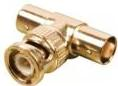

INKORANYAMUGA YIKORANABUHANGA

Impuzo y'ibikoresho by'ikoranabuhanga (ihūuza ry'ibikōreesho by'ikōranabūhaānga). Eng: Advanced Technology Attachment (ATA). Fr: Attachment de technologie avancée. NK: Ikoranabuhanga rya mudasobwa. SH: Igikoresho gihuza ibyuma muri mudasobwa. bwo guhuza mudasobwa n'itumanaho bukoreshwa mu guhuza ibikoresho bibikwamo ibintu byinshi, bugasimbura ikoranabuhanga rya kera rya ATA.

Impuzo ya T (impūuzo ya T). Eng: BNC T-piece connector. Fr: Connecteur BNC en T. NK: Ikoranabuhanga rya murandasi. SH: Icyuma gikoze nk'inyuguti ya T giherereye ku mpera y'urusinga kikifashishwa mu kurucomeka ku rundi.

Imyubakire y'amakuru (imyuūbakire y'āmakurū). Eng: Data architecture. Fr: Architecture des données. NK: Ikoranabuhanga rya mudasobwa. SH: Imbata y'amakuru isobanura uko amakuru abitse muri porogaramu za mudasobwa akoreshwa kandi yitabwaho, harimo: kuyahindura, kuyakwirakiza ku bindi bikoresho no ku mbuga nkoranyambaga.

Imyubakire y'ikoranabuhanga rigezweho (imyuūbakire y'ikōranabūhaānga rigezwēho). Eng: Modern Technology Architecture. Fr: Architecture technologique moderne. NK: Ikoranabuhanga rya mudasobwa. SH: Igishushanyo mbonera cy'ikoranabuhanga giteye imbere gishimangira umutekano wa sisitemu, imikoranire, n'imikorere.

Ineakirashusho (incakirashusho). Eng: Frame grabber. Fr: Carte d'acquisition; carte d'acquisition vidéo numérique; capture d'image. NK: Ikoranabuhanga rya mudasobwa. SH: Igikoresho cya mudasobwa mu bisanzwe bifata ishusho y'umurongo wa eregitoronike ucomeka mu bubiko bwa mudasobwa bwite.

Incomekabikoresho (incomekabikoreesho). Eng: Slot. Fr: Créneau. NK: Ikoranabuhanga rya mudasobwa. SH: Urwinjiriro kuri mudasobwa hashobora gucomekwa intwaramakuru hagafatwa nk'urwaguriro rushobora gushyirwa ku ndongozi ya mudasobwa kugira ngo rwakire amakarita y'urwaguriro yongera kuri mudasobwa ibikoresho nkoranabuhanga bigaha ukoresha mudasobwa kwisanzura mu gukoresha icyo ashaka mudasobwa no kuvugurura inzungano