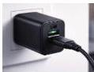

INKORANYAMUGA YIKORANABUHANGA

ayongeraho ibikoresho nk'ingaragazamashusho, ikarita huzanzira n'ikarita nsohorajwi.

**Incomekanyabikoresho koranabuhanga** (incomekanyabikoreesho kōranabūhaānga). Eng: Connector. Fr: Connecteur. NK: Ikoranabuhanga rya mudasobwa. SH: Igikoresho gihuza ibyiciro bibiri by'ibikoresho bifite amakuru, kikaba kigizwe n'inzira nkoranabuhanga ntwaramakuru.

**Incungamamafishiye** (incungamafishiye). Eng: File manager. Fr: Gestionnaire de fichiers. NK: Ikoranabuhanga rya mudasobwa. SH: igikoresho cyo gutunganya dosiye kuri mudasobwa yawe.

**Indahuzo** (indahuzo). Eng: Charger. Fr: Chargeur. NK: Ikoranabuhanga rya mudasobwa. SH: Igikoresho cy'ikoranabuhanga gifite akamaro ko kohereza ingufu z'amashanyarazi mu bikoresho nka mudasobwa na telefoni.

**Indanangizi** (indānaangizi) HI: Indanangiramakuru (indānaangiramākurū). Eng: Encryption key. Fr: Clé de cryptage. NK: Ikoranabuhanga rya mudasobwa. SH: Urukurikirane rw'uduce cyangwa inyuguti zikoreshwa mu gufunga no gukuraho amakuru.

**Indanga** (indaanga). Eng: Identifier. Fr: Identifiant. NK: Ikoranabuhanga rya mudasobwa. SH: Ijambo, izina, umubare, inyuguti, ikimenyetso, uruhurirane rw'ibintu bikoreshwa mu kuranga ku buryo bwihariye, ikintu, itsinda, umurimo, icyiciro cyangwa ikindi kintu cyagenwe n'ugikoresha, icyo kimenyetso kigahabwa mudasobwa, kigakoreshwa na buri serivisi koranabuhanga kugira ngo mudasobwa imenyekane aho iherereye, ikaba yacomekwaho, igakorerwaho ibikorwa byo kuyibungabunga bisanzwe, no kugira ngo itange serivisi y'ifasha biciye mu yakure, ikaba ari iremezo mu guhanga ururimi rwa mudasobwa.

**Indanga ya kuki** (indaanga ya kūki). Eng: Cookie. Fr: Cookie. NK: Ikoranabuhanga rya murandasi. SH: Agafishiye gato k'inyandiko karimo indanga rukumbi n'amakuru z'ukoresha murandasi koherezwa na mugabuzi y'urubuga rwa murandasi, ikakohereza inshakisha, kakabikwa ku gikoresho cy'ukoresha ikoranabuhanga, bigafasha urubuga rwa murandasi kubika ku urusurara nk'inshuro yasuye, indimi