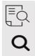
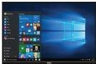
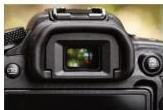

INKORANYAMUGA YIKORANABUHANGA

Indangashakiro (indaangashaakiro). Eng: Search icon. Fr: Icône de recherche. NK: Ikoranabuhanga rya mudasobwa. SH: Akamenyetso gakoreshwa mu gushakisha amafishiyeye cyangwa porogaramu muri mudasobwa.

Indango y'ikigo cy'ubucuruzi (indaango y'ikigo cy'ubucuruuzi). Eng: Business_Directory. Fr: Annuaire d'entreprise. NK: Ikoranabuhanga ry'imari. SH: Urubuga rw'ikoranabuhanga ry'ikigo cy'ubucuruzi cyangwa urutonde rucapye ruriho amakuru atondeka ibigo mu byiciro bishingiye ku hagaragara ko nta hangana mu bucuruzi rihari.

Indebero (indeebero). HI: Ingaragazamashusho (ingaragazamahusho); ingaragaza (ingaragaza); mugaragaza (mugaragaza); mwerekana (mweerekana). Eng: Computer Screen; Computer Monitor; Computer Display; Screen; Monitor; Visual Display Unit (VDU); Video

Graphics Array (VGA). Fr: Écran; moniteur d'ordinateur; moniteur; unité d'affichage visuel; Matrice graphique de vidéo. NK: Ikoranabuhanga rya mudasobwa. SH: Igice kirambuye cy'igikoresho ngaragazamashusho giherekeza mudasobwa gikozwe n'ibice bihekeranye bituma haboneka imiterere ya ngombwa igaragaza ishusho kuri icyo gikoresho.

Indebero jisho (indeebero jiisho). ENG: Optical viewfinder, Fr: Viseur optique. NK: Ikoranabuhanga ry'amashusho. SH: Igice cy'imfatashusho ureberamo ukoresheje amaso kugera ku mboni ya kamera kugira ngo ubone neza ishusho ugiye gufata, aho gukoresha indi ndebero ya kamera iba iyometseho.

Indebero ngaragazabara (indeebero ngāragazabāra). Eng: Color monitor. Fr: Moniteur en couleurs. NK: Ikoranabuhanga rya mudasobwa. SH: Insohoramakuru igaragaza amashusho, inyandiko n'amavidewo biri mu mabara atandukanye hakurikije iimpuzamabara ya RGB.

Indebero nkorashusho (ireebero nkoramashusho). Eng: Digitizer; graphics tablet; drawing tablet. Fr: Numériseur; tablette graphique; tablette à dessin. NK: Ikoranabuhanga rya mudasobwa. SH: Igikoresho

98