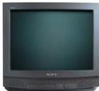

INKORANYAMUGA YIKORANABUHANGA

kigufasha kwinjiza ibishushanyo hamwe n'inyandiko zandikishijwe intoki muri mudasobwa.

**Indebero ya LCD** (indeebero ya LCD). HI: Ingaragaza ya LCD (ingaragaza ya LCD); ingaragaza nkorwaho (ingaragaza nkôrwahô). Eng: Liquid crystal display (LCD), LCD Monitor. Fr: Écran à cristaux liquides; affichage à cristaux liquides; écran LCD. NK: Ikoranabuhanga ry'amashusho. SH: Ubwoko bw’indebero bukoresha ikoranabuhanga rya LCD mu kugaragaza amashusho cyangwa inyandiko.

**Indebero ya tereviziyo** (indeebero ya tereviziyô). HI: Ingaragazamashusho ya televiziyo (ingaragazamashusho ya televiziyô). Eng: TV Monitor; monitor. Fr: Moniteur de télévision. NK: Ikoranabuhanga rya mudasobwa. SH: Igikoresho cy’irebero rishashe rikoresha imiraba ya LCD/LED nk’urwungano nyerekanamashusho rwa mudasobwa.

**Indebero ya Trinitron** (indeebero ya Trinitron). Eng: Trinitron. Fr: Trinitron. NK: Ikoranabuhanga rya mudasobwa. SH: Ubwoko bw’indebero bwakozwe na Sony mu wa 1968, bukaba bukoresha uburyo bwihariye bwo kwerekana amashusho asukuye.

**Indebero y’ukoresha inkoranabuhanga** (indeebero y’ûûkoreesha inkôranabûhaânga). HI: Uruganiro rw’ukoresha inkoranabuhanga (Urugaaniiro rw’ûukôreesha inkôranabûhaânga). Eng: Graphical user interface (GUI); Graphical interface; Graphical control element. Fr: Interface utilisateur graphique; utilitaire graphique; élément de contrôle graphique. NK: Ikoranabuhanga rya mudasobwa. SH: Aho abakoresha mudasobwa baganirira n’inkoranabuhanga hakoreshejwe ibimenyetso biboneshwa amaso aho kuba amategeko y’inyandiko.

**Indemabara** (indêmabâra). Eng: Chroma; chrominance. Fr: Chrome; chrominance. NK: Ikoranabuhanga rya mudasobwa. SH: Igipimo cy’umwimerere w’ibara.

**Indemashusho** (indemashusho). Eng: Pixel. Fr: Pixel. NK: Ikoranabuhanga rya mudasobwa. SH: Ikinyabumwe cy’ibara gito cyane gishobora gukoreshwa mu nkoranabuhanga nko muri gahunda y’irebero rya mudasobwa cyangwa mu ishusho rya mudasobwa.