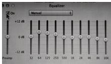

INKORANYAMUGA YIKORANABUHANGA

Indemo (indemo). HI: Amakuru atunganyijwe (amakurū atūungaanyijwe). Eng: Content. Fr: Contenu. NK: Isakazabumenyi koranabuhanga. SH: Ijwi, inyandiko, ishusho riri hamwe, ishusho rigenda cyangwa ubundi buryo bwose bukomatanya amajwi n'amashusho, ubutumwa bukoresha ibimenyetso by'intoki, cyangwa uburyo bukomatanya uburyo bwose bumaze kuvugwa bushobora gukorwa, gufatwa, kubikwa, kongera kuboneka cyangwa kugezwa ku bandi mu buryo bw'ikoranabuhanga.

Indindabutumwa budakenewe (indiindabūtumwā budakenewe). Eng: Antispam. Fr: Anti-spam. NK: Ikoranabuhanga rya murandasi. SH: Igamije kugenzura no guhagarika imeri zishobora guteza ibibazo ziturutse mu bubiko bwanyirayo.

Indindampuzanzira (indiindampuuzanzira). Eng: Firewall. Fr: Pare-feu. NK: Ikoranabuhanga rya mudasobwa. SH: Urwungano ndindamutekano huzanzira rucunga rukanagenzura itambuka ry'amakuru, haba ari ayinjira n'asohoka hashingiwe ku mategeko y'umutekano asanzwe agenwe.

Indangamwimereri (indāngamwīimerēri). Eng: Watermark. Fr: Filigrane. NK: Ikoranabuhanga rya mudasobwa. SH: Ikimenyetso gishyirwa ku rupapuro cyangwa inyandiko kigaragara iyo kerekejwe ku rumuri kirinda ko iyo nyandiko cyangwa urupapuro byakiganwa mu buryo butemewe.

Indinganizajwi (indiinganizajwi). Eng: Equalizer (EQ). Fr: Égalisateur. NK: Ikoranabuhanga ry'amajwi. SH: Igikoresho cyifashishwa mu gushyira ku murongo ubwiyongere bw'amajwi no kuyashyira ku bipimo bitandukanye kugira ngo urwunge rwayo runogere amatwi bitewe n'uko yifuzwa kumvwa.

Indondoramakuru y'indindampuzanzira (indōondoramākurū y'īndiindamūdasobwā). Eng: Firewall log. Fr: Journal du pare-feu. NK: Ikoranabuhanga rya mudasobwa. SH: Iyandikwa ry'uburyo indindamudasobwa icunga amoko atandukanye y'ibihita, indangambonezanzira n'inkomoko n'iz'aho ubutumwa bujya,