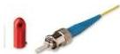

INKORANYAMUGA YIKORANABUHANGA

Agahuza (agahuúza). Eng: Straight Tip connector; ST connector. Fr: Connecteur à pointe droite. NK: Ikoranabuhanga rya murandasi. SH: Igikoresho cyifashishwa mu mu guhuza no gutandukanya insinga z'ihuzanzira zinyuzwa mu butaka.

Agakayi koranabuhanga (agakayi kōranabuhaānga). Eng: OneNote. Fr: OneNote. NK: Ikoranabuhanga rya mudasobwa. SH: Inkoranabuhanga ikora incamake koranabuhanga, ikagira ububiko bumwe rukumbi ishyiramo incamake z'inyandiko, z'ubushakashatsi, muri make ibyo ugomba kwibuka kugira ngo ucunge urugo rwawe, akazi kawe cyangwa ibyo ugomba kwibuka ku ishuri.

Agasanduka k'ibikoresho koranabuhanga (agasāandukā k'ibikōreesho kōranabuhaānga). Eng: ICT Toolbox. Fr: Boîte à outils informatique. NK: Ikoranabuhanga rya mudasobwa. SH: Zimwe mu ntambwe ziteguye zinyurwamo mu gihe cyo kwandika porogaramu za mudasobwa.

Agasanduku k'ubutumwa koranabuhanga (agasāandukū k'ūbutumwā kōranabuhaānga). Eng: Email box; e-mailbox; electronic mailbox; mailbox. Fr: Boîte aux lettres électronique; boîte de messagerie; boîte e-mail; boîte aux lettres e-mail; boîte e-mail; messagerie. NK: Ikoranabuhanga rya murandasi. SH: Ububiko bw'ikoranabuhanga bwakira, bugashyingura

bukanacunga ubutumwa koranabuhanga bw'ukoresha ikoranabuhanga.

Agashusho ndangabubiko (agashusho ndāangabūbiiko). Eng: My computer. Fr: Mon ordinateur. NK: Ikoranabuhanga rya mudasobwa. SH: Akarango gashyirwa ahagana ibumoso h'ikirahure kuri mudasobwa hagamijwe kwerekana ibiri muri mudasobwa.

Agashusho nyobora (agashusho nyobora). HI: Agashusho ndanga (agashusho ndaanga). Eng: Icon. Fra: Icône. NK: Ikoranabuhanga rya mudasobwa. SH: Ishusho igaragara ku ndebero ya mudasobwa ikerekana inkoranabuhanga ikoreshwa, igikoresho nkoranabuhanga cyangwa indi nshoza cyangwa imiterere yihariye ifite

icyo isobanuye ku muntu ukoresha mudasobwa.