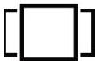
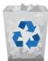

INKORANYAMUGA YIKORANABUHANGA

limites. NK: Ikoranabuhanga rya mudasobwa. SH: Uburyo bukoreshwa mu bishushanyo bya mudasobwa no mu gukora amashusho ya 3D, bwo gusobanura ishusho y'ikintu gikomeye hifashishijwe imbibi zacyo, nko mu maso, imirongo, n'utudomo.

Ingaragazambere y'icapwa (ingaragazambere y'icapwa). Eng: Print preview. Fr: Aperçu avant impression. NK: Ikoranabuhanga rya mudasobwa. SH: Uburyo porogaramu ya mucapyi ifasha abayikoresha kureba uko inyandiko iri bugaragare nisohorwa.

Ingaragazamikoro (ingāragazamīkoro). Eng: Task View. Fr: Affichage des tâches. NK: Ikoranabuhanga rya mudasobwa. SH: Agashusho ndanga kerekana amadirishya yose afunguye kuri mudasobwa.

Ingaragazamiterere (ingāragazamīteēre). Eng: Display attribute. Fr: Attribut d'affichage. NK: Ikoranabuhanga rya mudasobwa. SH: Imfatashusho isobanura ishusho, ingano n'ibara ry'inyandiko cyangwa igishushanyo bigaragara ku nsakazamashusho.

Ingaragazamiterere y'imiraba (ingāragazamīteēre y'imirāba). Eng: Wave form monitor; waveform scope. Fr: Moniteur de forme d'ondes; oscilloscope de forme d'ondes. NK: Ikoranabuhanga rya mudasobwa. SH: Igikoresho cy'ikoranabuhanga gikoreshwa kwerekana no gusesengura imiterere, urwego, n'igihe cy'ibimenyetso bya video cyangwa audio mu ishusho y'imiraba, bigafasha abatekinisiye kugenzura ubuziranenge n'ubunyangamugayo bw'ibimenyetso.

Ingaragazandiba y'indebero (ingāragazandība y'indeebero). Eng: Background; desktop background; desktop picture; desktop image. Fr: Fond d'écran. NK: Ikoranabuhanga rya mudasobwa. SH: Ifoto cyangwa igishushanyo kigaragara; mu ngaragazamashusho nk'umutako mu gihe ifunguye.

Ingarani (ingaraani). HI: Puberi (pubeēri). Eng: Trashcan; recycle bin; trash bin; dustbin; wastebasket. Fr: Poubelle. NK: Ikoranabuhanga rya mudasobwa. SH: Gahunda ya mudasobwa ibika ibidakenewe mu gihe gito byasibwe, kugira ngo nihabaho kwivuguruza uwasibye abe yabigarura cyangwa abikureho burundu.

Ingaruramakuru koranabuhanga (ingāruramākurū kōranabūhaānga). Eng: Recovery Console. Fr: Console de récupération. NK: