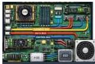

INKORANYAMUGA YIKORANABUHANGA

Injyanamakuru (injyanamakuru). Eng: Bus. Fr: Bus. NK: Ikoranabuhanga rya mudasobwa. SH: Umuyoboro w'itumanaho ibimenyetso bijyaho bikakirwa n'igikoresho gicometse ku ihuzanzira, bukaba ari uburyo bwo kohererezanya amakuru hagati y'ibikoresho bifatika cyangwa

inkoranabuhanga hatibagiranye n'imbonezanzira z'itumanaho, byaba bikozwe muri mudasobwa imbere cyangwa hagati ya za mudasobwa.

Inkandirwabumoso (inkāandirwabūmosō). HI: Imbarutso y'ibumoso (imbārutso y'ibumoso); ikanda ry'ibumoso (ikaanda ry'ibumoso). Eng: Left click; main click; default click. Fr: Bouton gauche. NK: Ikoranabuhanga rya mudasobwa. SH: Akabuto k'ibanze k'imbeba gakoreshwa bagakanda, batoranya imbonera, bakanyereza kugira ngo bagaragazeicyane ijambo cyangwa ikintu kandi gakora nk'akayoborambeba.

Inkandirwaburyo (inkāandirwabūryo). HI: Imbarutso y'iburyo (imbārutso y'iburyō); ikanda ry'iburyoo (ikaanda ry'iburyō). Eng: Right click; secondary click. Fr: Bouton droit; clic droit. NK: Ikoranabuhanga rya mudasobwa. SH: Akabuto kungiriza ubusanzwe gafungura inzira ya bugufi kaganisha ku ngingo z'ibikorwa, kagatanga amahitamo yerekeye amafishiye, indangabikorwa cyangwa agace k'irebero akanyerezo ngaragazahantu gaherereyemo.

Inkengro mfatiranzira (igikōreesho mfatiranzira). Eng: Head end. Fr: Périphérique de tête de réseau. NK: Ikoranabuhanga rya mudasobwa. SH: Igikoresho cyo kugenzura gikenewe n'imiyoboro imwe n'imwe (urugero, imiyoboro ya hafi (LAN) cyangwa imiyoboro yo mu gace k'umujyi (MAN)).

Inkeshafoto (inkeeshafoto). Eng: White Balance. Fr: Balance blanche. NK: Ikoranabuhanga ry'amashusho. SH: Imiterere myiza y'ingano y'umweru ibuza amashusho kugira ibara runaka, nk'icyatsi kibisi giterwa n'amatara ya fluorescent.

Inkeshashusho (inkeeshashusho). Eng: Active-matrix. Fr: Matrice active. NK: Ikoranabuhanga rya mudasobwa. SH: Ubwoko bw'ikoranabuhanga ryo kwerekana, rikunze gukoreshwa mu ndebero ya LCD na OLED, aho buri ndemashusho igenzurwa ukwayo n'intuburamiraba nyatwugara (TFT) n'akabikamuriro.

107