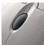
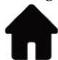

INKORANYAMUGA YIKORANABUHANGA

Agatabo ka aderesi (agatabo kaa adereěsi). Eng: Adress book. Fr: Carnet d'adresses. NK: Ikoranabuhanga rya murandasi. SH: Urutonde rwa aderesi za imeri zose ukoresha kenshi.

Agatabo ndanga (agatabo ndaanga). HI: Ubushyinguro paji (ubushyíinguro paáji). Eng: Bookmark. Fr: Signet. NK: Ikoranabuhanga rya murandasi. SH: Uburyo bw'ikoranabuhanga bw'ikigo cya Mikorosofuti bufasha porogaramu za murandasi zitandukanye bukanagira imikorere myiza y'ishakiro ry'amakuru kuri murandasi.

Agatemberezo (agateemberezo). Eng: Slider; Trackbar. Fr: Barre de défilement. NK: Ikoranabuhanga rya murandasi. SH: Akantu gakoreshwa mu kugenda wihuse ku rupapuro mu byerekezo byose by'indebero, kakereka ukoresha mudasobwa aho ari bushyire icyo ashaka kongera mu byo yandika cyangwa yakoraga kuri urwo rupapuro, cyangwa aho icyo ashaka gukora kiri bukorerwe, gakunda.

kuba kari mu isura ry'ikiganza cyangwa ikimenyetso cyo guteranya ku makarita.

Agatende k'imbeba (agateěnde k'imbeba). Eng: Stroll wheel; scroll wheel. Fr: Molette de défilement. NK: Ikoranabuhanga rya mudasobwa. SH: Akagurudumu kaba ku mbeba ya mudasobwa kakagira umumaro wo kuzamura cyangwa kumanura ifishiye, akenshi gakoze muri pulasitiki ikomeye iriho agakawucu, kakaba hagati y'imfatamakuru mwikarago iri mu mbeba.

Ahabanza (ahabāanza). Eng: Home page; homepage; start page. Fr: Page d'accueil. NK: Ikoranabuhanga rya murandasi. SH: Urukuta (ipaji) rubanza ku rubuga, aho urusuye agomba kunyura, bigafasha kwereka urusuye aho yanyura bitewe n'ibyo akeneye.

Ahagera ihuzanzira (ahagēra ihuuzanzira). Eng: Network Coverage; Internet coverage; coverage. Fr: Couverture Internet. NK: Ikoranabuhanga rya murandasi. SH: Ahantu hose hagerwa n'ihuzanzira n'indi miyoboro ya murandasi, bikagaragazwa n'ingano y'abantu bashobora kubona no kwakira uburyo bw'ihuzanzira kuri telefoni zabo cyangwa mudasobwa.