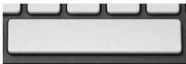
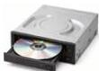

INKORANYAMUGA YIKORANABUHANGA

Inshyikizo (inshyikizo). Eng: Terminal equipment. Fr: Équipement terminal. NK: Ikoranabuhanga rya mudasobwa. SH: Igikoresho cyangwa ikindi kintu cyose gifatwa nk'igikoresho cyabugenewe cyateganyirijwe gucomekwa mu buryo ubwo ari bwo bwose, ahantu abafatabuguzi bashobora gufatira inzira ku miyoboro rusange, mu ihuzanzira aho ni mudasobwa, telefoni cyangwa urubuga mpuzanzira bicometse ku ihuzanzira.

Insibyi (insibyi). HI: Buto yo gusiba (buto yō gusiba). Eng: Delete button. Fr: Boutton Supprimer. NK: Ikoranabuhanga rya mudasobwa. SH: Akantu ko kuri mwandikisho gakoreshwa mu gusiba inyuguti cyangwa ikimenyetso kiri iburyo bw'inyoboranyandiko.

Insigamwanya (insigamwaanya). Eng: Spacebar. Fr: Barre d'espacement; barre d'espace. NK: Ikoranabuhanga rya mudasobwa. SH: Akantu karekare usanga

ku murongo wa nyuma wa mwandikisho gakoreshwa mu gusiga akanya mu gihe umuntu ari kwinjiza amakuru muri mudasobwa.

Insohoramakuru (insohoramakuru). Eng: Computer output device; output device; output unit. Fr: Périphérique de sortie d'ordinateur; périphérique de sortie; unité de sortie. NK: Ikoranabuhanga rya mudasobwa. SH: Igikoresho cyohereza amakuru ya mudasobwa hagati y'igikoresho n'abakiriya.

Insoma ntangazamakuru (insōma ntangazamakuru). Eng: Media player. Fr: Lecteur multimédia. NK: Ikoranabuhanga rya mudasobwa. SH: Inkoranabuhanga cyangwa igikoresho gituma abantu bashobora gusoma amafishiye y'amajwi n'amashusho koranabuhanga bivuye ku gikoresho mbikamakuru, imbikamakuru ruziga cyangwa ibibonerwaho kuri murandasi.

Insomadisike (insōmadisike). Eng: Disk drive. Fr: Lecteur de disque. NK: Ikoranabuhanga rya mudasobwa. SH: Igikoresho cya mudasobwa gifasha mu kubika no gusoma amakuru kuri disike.

Insomadisike mbonesharumuri (insōmadisike mboneesharumuri). Eng: Optical disk drive. Fr: Lecteur de disque optique. NK: