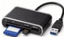
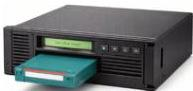
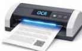

INKORANYAMUGA YIKORANABUHANGA

Ikoranabuhanga rya mudasobwa. SH: Igikoresho gisoma disiki y'urumuri ikoresha urumuri rwa laser kugira ngo isome amakuru ari muri disiki uko izenguruka.

**Insomakarita** (insômakârita). Eng: Card Reader. Fr: Lecteur de carte. NK: Ikoranabuhanga rya mudasobwa. SH: Igikoresho nyinjizamakuru gisoma amakuru y'amakarita atandukanye, nk'amakarita yo kwishyura, furashi, indangamu ntu, ndetse n'ibyoherejwe ku yindi mudasobwa cyangwa ikindi gikoresho.

**Insomakasete** (insômakâseête). Eng: Tape drive. Fr: Lecteur de bande. NK: Ikoranabuhanga rya mudasobwa. SH: Igikoresho kibika amakuru y'ikoranabuhanga kuri kaseti hagamijwe kuyabungabunga no kuyashyingura.

**Insomamakuru ya mudasobwa** (insômamâkurû nkôranabûhaânga). Eng: Computer drive. Fr: Lecteur informatique. NK: Ikoranabuhanga rya mudasobwa. SH: Igikoresho kibika amakuru nyamibare kuri mudasobwa kikaba cyayagaragaza igihe cyose akenewe, kiboneka mu buryo bubiri: imbikamakuru ahoraho (HDD) cyangwa disiki (SSD).

**Insomanyandiko nyamiraba** (insomanyandiko nyamiraba). Eng: Optical Character Reader (OCR). Fr: Reconnaissance optique de caractères. NK: Ikoranabuhanga rya mudasobwa. SH: Igikoresho gishobora kunyuza amakuru ari ku mpapuro mu cyuma kigahita kiyinjiza muri mudasobwa kugira ngo abikwe cyangwa anozwe.

**Insozamuyoboro** (insoozamuyoboro). Eng: Termination station; End station; End device. Fr: Point de terminaison; Station finale; système final; Périphérique final. NK: Ikoranabuhanga rya murandasi. SH: Igikoresho gifatika gihuzwa n'ihuzanzira rya murandasi bikohererezanya ubutumwa.

**Insubiragikorwa** (insûbiiragikorwâ). Eng: Loop. Fr: Boucle. NK: Ikoranabuhanga rya mudasobwa. SH: Ibikorwa bitandukanye byerekeye