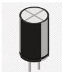

INKORANYAMUGA YIKORANABUHANGA

**Ahaherereye amakuru** (ahaherereye amakurû). Eng: Location. Fr: Emplacement. NK: Ikoranabuhanga rya mudasobwa. SH: Ahantu hashobora gusobanurwa hifashishijwe ibisobanuro byanditse ari byo imibare y'inyabubiri, hakarangwa no kugira indanga, korohereza ibika ry'amakuru cyangwa kuyabona.

**Ahandikwa** (ahaândikwa). Eng: Text window. Fr: Fenêtre. NK: Ikoranabuhanga rya mudasobwa. SH: Akadirishya ko muri sisiteme yo gushushanya kuri mudasobwa, gashyirwamo amagambo mbere yo kuyajyana aho agenewe.

**Ahandikwa ku ifoto** (ahaândikwa ku iifoto). Eng: Text box. Fr: Zone de texte. NK: Ikoranabuhanga rya mudasobwa. SH: Uruganiriro rushyirwa ku ishusho cyangwa ifoto (GUI) haba hameze nk'urukiramende, hashobora kwimurwa cyangwa guhindurirwa ingano, hagakoreshwa mu kwandikamo, guhindura ibyanditse cyangwa kwerekana inyandiko, bigafasha abakoresha mudasobwa gukorana n'inkoranabuhanga cyangwa urubuga rwa mudasobwa umuntu yandika inyandiko, ayishyiraho cyangwa akaba yayisoma.

**Akabikamuriro** (akabiikamuriro). Eng: Capacitor. Fr: Condensateur. NK: Ikoranabuhanga ry'imiraba. SH: Agakoresho ko mu ikoranabuhanga kakira gusa, gakoreshwa mu kubika igihe gito amashanyarazi, kakagira ahantu hashashe habiri ntwaramashanyarazi hatandukanywa n'inkumiramashanyarazi (ibumba, purasitiki,...).

**Akadege** (akadeêge). Eng: AirpFlight mode. Fr: Mode avion. NK: Itumanaho koranabuhanga. SH: Uburyo bw'imikorere y'igikoresho gitotoniki, twavuga nka telefoni, aho icyo gikoresho kitajya ku ihuzanzira nziramugozi, bity o ntigishobore kohereza cyangwa kwakira amakuru (guhamagara, ubutumwa), ndetse ntigishobore gufata murandasi arikoi kikaba gishobora gukomeza gukoreshwa ku bundi buryo.

**Akadirishya rembo** (akadirishyâ réembo). EnIg: Home tab. Fr: Onglet Accueil. NK: Ikoranabuhanga rya mudasobwa. SH: Ahantu ubanziriza