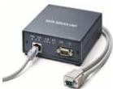
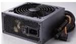

INKORANYAMUGA YIKORANABUHANGA

**Intangamakuru** (intāangamākurū). Eng: Data Service Unit (DSU); Channel Service Unit (CSU); digital service unit. Fr: Unité de service de données; unité de service numérique. NK: Ikoranabuhanga rya murandasi. SH: Igikoresho cyo ku mpera y'umuyoboro w'itumanaho gihindura amakuru y'ikoranabuhanga avuye mu ikoranabuhanga ry'itumanaho rya hafi (LAN) kikayahindura ayo mu muyoboro mugari w'itumanaho (WAN) cyangwa se bikava mu itumanaho rusange biza mu itumanaho ryihariye.

**Intangamiterere y'ipaji** (intāangamīteēre y'ipaāji). Eng: Extensible Style Sheet Language Transformation (XSLT). Fr: Transformation du langage extensible de la feuille de style. NK: Ikoranabuhanga rya mudasobwa. SH: Guhindura inyandiko hakoreshejwe ururimi rw'imiterere y'inyandiko itunganijwe.

**Intangamuriro** (intaangamuriro). Eng: Power supply unit (PSU). Fr: Bloc d'alimentation. NK: Ikoranabuhanga rya mudasobwa. SH: Kimwe mu bigize urwungano rw'ikoranabuhanga by'ingenzi, kikagira umumaro wo gutanga umuriro mu bindi bice bya mudasobwa (indongozi ya mudasobwa, inshozamudasobwa, ingarazamashusho, imbikamakuru) harimo n'ibikoresho koranabuhanga byashyizwemo, twavuga nk'imbonezashusho, imbikamakuru ahoraho y'inyongera, igakora ku buryo buri gikoresho kibona umuriro uhagije ngo gikore neza.

**Intanganama y'ubwenge buhangano** (intāanganāma y'ūubwēenge buhaangano). Eng: Recommendation system. Fr: Système de recommandation. NK: Ubwenge buhangano. SH: Uburyo bwo gutanga inama bukoresha ubuhanga bw'ubwenge buhangano kugira ngo butange ibitekerezo ku bikubiye mu nyandiko, ibicuruzwa, cyangwa ibikorwa bishingiye ku myitwarire yawe n'ibyo ukunda.

**Intanganzira** (intaanganzira). HI: Rawuta (rawūta). Eng: Router. Fr: Routeur. NK: Ikoranabuhanga rya murandasi. SH: Igikoresho cy'ihuzanzira gitu ma ihuzanzira hagati yaryo rihererekanya amapaki y'amakuru.

