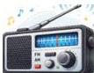
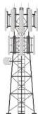

INKORANYAMUGA YIKORANABUHANGA

Wi-Fi card. Fr: Carte sans fil; carte réseau sans fil; carte Wi-Fi. NK: Ikoranabuhanga rya murandasi. SH: Igikoresho gituma imashini nka mudasobwa cyangwa telefoni igezweho zifata ihuzanzira nziramugozi.

**Inyakirabutumwa mvugo** (inyākiirabūtumwā mvūgo). Eng: Voicemail; voice message; voice bank. Fr: Messagerie vocale. NK: Ikoranabuhanga rya mudasobwa. SH: Ubutumva bw’amajwi umuntu yifata kuri telefone iyo uwo ahamagaye atitabye.

**Inyakiramajwi** (inyākiiramājwi). HI: Radiyo (raadiyō). Eng: Radio. Fr: Radio. NK: Isakazamakuru. SH: Igikoresho cyakira imiraba iturutse ku nsakazamajwi kayihinduramo amajwi yumvikana, kikagezaho abantu ubutumwa mu magambo, umuziki,...

**Inyakiramajwi ngendanwa** (Inyākiiramājwi ngeendānwa). Eng: Mobile radiophone. Fr: Radiotéléphonie mobile. NK: Ikoranabuhanga rya mudasobwa. SH: Insakazamajwi ikoranye na telefoni yifashisha imirongo ya radio bigendanye naho iherereye, ikabikora ku mirongo migari.

**Inyakiramajwi remezo** (inyākiiramājwi remezo). Umunara w’inyakiramajwi (umunara w’iinyākiiramājwi). Eng: Base station. Fr: Station de base. NK: Ikoranabuhanga rya murandasi. SH: Umunara w’itumanaho utuma itumanaho rigenda neza, ukegeranya amajwi mu ihuzanzira nziramugozi rya hafi, kandi ukaba wanahuza ihuzanzira nyamugozi n’ihuzanzira nziramugozi, ukaba ugizwe n’inyoherezamajwi ikoresha ingufu nke n’intanganzira nziramugozi.

**Inyakiramakuru ngendanwa y’icyogajuru** (inyākiiramākurū ngeendānwa y’icyoogajuru). HI: Eng: Mobile earth terminal. Fr: Station terrienne mobile. NK: Ikoranabuhanga rya murandasi. SH: Icyuma gikora nka anteni gishobora kugendanwa gikoreshwa mu itumanaho ry’icyogajuru.

**Inyakirarubuga** (inyākiirarūbuga). Eng: Web Host. Fr: Hébergeur web. NK: Ikoranabuhanga rya mudasobwa. SH: Ikigo cyangwa serivisi itanga ikoranabuhanga n’aho kubika inyandiko z’urubuga kugira ngo rubashe kugerwaho kuri murandasi.

130