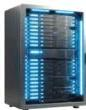
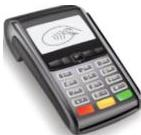

INKORANYAMUGA YIKORANABUHANGA

kuri mudasobwa harimo ibikoresho by'ibanze byo guhindura no gutunganya inyandiko.

**Akadirishya rugo** (akadirishyā rugō). Eng: Another added tab. Fr: Onglet Accueil. NK: Ikoranabuhanga rya mudasobwa. SH: Ahantu ubanziriza kuri mudasobwa harimo ibikoresho by'ibanze byo guhindura no gutunganya inyandiko.

**Akagega k'umuyoboro mugufi** (akagega k'ūmuyoboro mugufī). Eng: LAN server; file server; server to a local-area network (LAN). Fr: Serveur LAN; serveur de fichiers, serveur vers un réseau local (LAN). NK: Ikoranabuhanga rya mudasobwa. SH: Mudasobwa ifite ububasha bwo kohereza amakuru ku gipimo cyo hejuru, ikaba ibitse gahunda z'inkoranabuhanga n'amafishiye ya zamudasobwa zihuriye ku ihuzanzira.

**Akagege** (akageege). Eng: Rack. Fr: Bai. NK: Ikoranabuhanga rya mudasobwa. SH: Akantu gashyirwaho za mugabuzi cyangwa ibindi bikoresho by'ihuzanzira akenshi karangwa no kugira imyanya igerekeranye.

**Akamashini kishyurirwaho** (akamāshini kiishyūrirwahō). Eng: Payment terminal; Card machine; Credit card machine. Fr: Terminal de paiement électronique. NK: Ikoranabuhanga ry'imari. SH: Igikoresho cyifashishwa mu bucuruzi mu kwishyura mu buryo bw'ikoranabuhanga no gukora ibikorwa bya serivisi za banki.

**Akamashini mbikambikuza** (akamāshini ko kwishyuriraho). Eng: Point of selling (POS) system. Fr: Système de point de vente (PDV). NK: Ikoranabuhanga ry'imari. SH: Igikoresho kigizwe n'ibice bibiri: mudasobwa cyangwa ikindi gikora nka yo n'inkoranabuhanga, byoroshya mu kugura k'umukiriya, gucunga igurisha, no gukurikirana imbona nkubone ibihunitswe ku buryo usanga ari urubuga nsanganya ku mucuruzi w'umudandaza, amahoteri cyangwa ibigo bitanga serivisi.