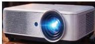

INKORANYAMUGA YIKORANABUHANGA

Inyerekana (inyerekana). Eng: Projector. Fr: Projecteur. NK: Urusobe ntangamakuru. SH: Igikoresho kigaragaza ibiri ku ndebero (amashusho, inyandiko,...) hakoreshejwe urumuri rw'amashanyarazi

ku hantu hashashe h'umweru nko ku kibaho, igitambaro cyangwa urukuta urukuta.

Inyerekanyi (inyerekanyi). HI: Igikoresho ngaragaza (igikoreesho ngaragaza). Eng: Pointing device. Fr: Dispositif de pointage. NK: Ikoranabuhanga rya mudasobwa. SH: Igikoresho kigenzura imiyego y'akanyerezo ngaragazahantu ku irebero, twavuga nk'imbeba, ingaragaza rebero, agakoni nyamukino, ibiye ntangamategeko, invuburanyandiko, kigafasha guhitamo ahantu ku irebero, kikagenzura imiyego y'akanyerezo ngaragazahantu.

Inyibamakuru (inyibamakuru). Eng: Spyware. Fr: Logiciel espion. NK: Ikoranabuhanga rya mudasobwa. SH: Porogaramu ishyirwa mu gikoresho cya mudasobwa mu ibanga, ikaba igamije kwereka uwashyizemo porogaramu amakuru nyiri mudasobwa yakiriye ndetse n'uburyo ki akoresha murandasi.

Inyigana (inyigaana). Eng: Emulator. Fr: Émulateur. NK: Ikoranabuhanga rya mudasobwa. SH: Igikoresho cyangwa inkoranabuhanga bituma urwungano rwa mudasobwa rwakira rwitwara nk'aho ari urundi rwungano rwitwa umushyitsi.

Inyiganamiterere nyamorekire (inyigaanamiteere nyamorekiire). Eng: Molecular representation; Molecular system. Fr: Representation moleculaire; Systeme moleculaire. NK: Ubwenge buhangano. SH: Uburyo bwo kwerekana imiterere ya morekire mu ishusho yumvikana hakoreshejwe ikigero cyo kwigiraho kwa mudasobwa, nk'urujyano, ishusho cyangwa isura mpandeshatu (3 D).

Inyigisha (inyigiisha). Eng: Tutorial. Fr: Tutoriel. NK: Urusobe ntangamakuru. SH: Porogaramu y'amasomo ifasha kwiga uko ukoresha porogaramu runaka cyangwa uko wakora igikorwa runaka mu ikoranabuhanga binyuze mu ntambwe ku yindi.

Inyigisho z'iyakure (inyigiisho z'iyakure). Eng: E-learning; electronic learning; online learning. Fr: Formation en ligne; apprentissage