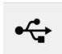

INKORANYAMUGA YIKORANABUHANGA

Inyobora ya USB (inyōbora ya USB). Eng: USB Driver. Fr: Pilote USB. NK: Ikoranabuhanga rya mudasobwa. SH: Inkoranabuhanga yihariye ya mudasobwa ikenerwa mu ikoreshwa rya USB, yaba ari umugozi wayo, fulashi cyangwa urwinjiriro rwayo.

Inyobozi (inyobozi). Eng: Joystick; Gamepad. Fr: Manette de jeu. NK: Ikoranabuhanga rya mudasobwa. SH: Igikoresho nyinjizamakuru eigendanwa gituma umuntu agenzura imiyego cyangwa ibikorwa by'ikintu koranabuhanga ku irebero rya mudasobwa, kikaba n'urufatiro cyangwa mushyiguzi gishobora kubogamira mu ruhande runaka cyangwa gusunikwa mu byerekezo bitandukanye kugira ngo gikorane na mudasobwa cyangwa urukiniro.

Inyobozi y'amakuru (inyobozi y'āmakurū). Eng: Metadata. Fr: Métadonnées. NK: Ikoranabuhanga rya mudasobwa. SH: Ibyangombwa kugira ngo amakuru akenewe ku makuru yumvikane, amakuru ashobore gukorerwa incamake, nko gushaka amakuru yayo, kureba aho yavuye, ireme ryayo, uko yubatse no kuba yabasha gusurwa.

Inyohereza nyakira (inkubirānya). Eng: Diplex. Fr: Diplex. NK: Ikoranabuhanga rya mudasobwa. SH: Igikoresho cyangwa uruboho rw'amashanyarazi rwemera kwakira cyangwa kohereza imiraba ibiri igendeye rimwe.

Inyohereza nyakiramakuru (inyohereza nyākiirāmākurū). HI: Modemu (modeemu). Eng: Modulator-Demodulator; Modem. Fr: Modem. NK: Ikoranabuhanga rya mudasobwa. SH: Agakoresho gafasha mu kohereza amakuru kuri telefoni avuye kuri mudasobwa kabanje kuyahindura mu buryo telefoni ibasha kuyasoma.

Inyoherezabutumwa ya murandasi (inyōherezabūtumwā ya mūraandasi). Eng: Webmail. Fr: Courriel Web. NK: Ikoranabuhanga rya mudasobwa. SH: Serivisi yo kohereza no kwakira ubutumwa bwa imeri ushobora gukoresha binyuze mu ishakiro rya interineti, nta gahunda yihariye yo kohereza imeri isabwa.