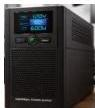

INKORANYAMUGA YIKORANABUHANGA

nk'igisubizo nyuma y'icyiza hagamijwe kurengera ibikorwaremezo koranabuhanga by'ikigo.

**Inzamuramakuru** (inzâamuuramâkurû). HI: Inzira nzamuramakuru (inzira nzâamuuramâkurû). Eng: Uplink. Fr: Liaison montante. NK: Ikoranabuhanga rya murandasi. SH: Umuyoboro ujyana sinyare (signals) ku cyogajuru zivuye ku isi.

**Inzigamamuriro y'ikoranabuhanga** (inzigamamuriro y'ikôranabûhaânga). Eng: Universal Power Supply (UPS). Fr: Alimentation universelle. NK: Ikoranabuhanga rya mudasobwa. SH: Igikoresho kibika ingufu z'umuriro w'amashanyarazi kifashishwa igihe umuntu ari ahantu hatari umuriro w'amashanyarazi cyangwa habayeho ibura ry'amashanyarazi kandi akeneye gukoresha ikoranabuhanga rya mudasobwa.

**Inzigamyi koranabuhaanga** (inzîgamyi kôranabûhaânga). Eng: Quick Part. Fr: Pièce rapide. NK: Ikoranabuhanga rya mudasobwa. SH: Igikoresho cya Mikorosofuti Ofisi (cyane cyane Wadi na Awutuluku) gituma indemo ibikwa ikazongera gukoreshwa (inyandiko, amafoto, imbata) hagamijwe kwihutisha ihangwa ry'inyandiko.

**Inzira** (inzira). HI: Kwijira (kwiinjira). Eng: Access. Fr: Accès. NK: Ikoranabuhanga rya mudasobwa. SH: Uburenganzira umuntu ahabwa bwo gufungura mudasobwa agasoma cyangwa agakoresha amakuru arimo.

**Inzira ndinganire** (inzira ndinganire). Eng: Parallel port. Fr: Port parallèle. NK: Ikoranabuhanga rya mudasobwa. SH: Ubwoko bw'uburyo bwo guhuza mudasobwa bukunze gukoreshwa mu guhuza ibikoresho nka mucapyi na sikaneri kuri mudasobwa.

**Inzira ngenzuzi** (inzira ngeenzuuzi). Eng: Control link. Fr: Lien de contrôle. NK: Ikoranabuhanga rya mudasobwa. SH: Amategeko abiri cyangwa menshi ya sisitemu ahurije hamwe, bikaba ibiyigize bigufasha guhuza igenzura ry'ibishushanyo bitandukanye bikorera ahantu hamwe cyangwa mu rundi rusobe rwihariye.

**Inzira nkoranabuhanga** (inzira nkôranabûhaânga). Eng: Embedded electronic circuit; computer chip; microchip; chip. Fr: Circuit électronique embarqué; puce informatique; puce électronique; puce. NK: