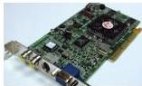
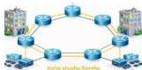

INKORANYAMUGA Y'IKORANABUHANGA

Ikoranabuhanga rya mudasobwa. SH: Akantu gato kabwase gakoze mu bikoresho ntwaramashanyarazi gitoroniki karimo intwaramakuru gitoroniki.

Inzira ntondeke (inzira ntoôndeke). Eng: Serial port. Fr: Port série. NK: Ikoranabuhanga rya mudasobwa. SH: Uburyo bukoreshwa mu gutumanaho amakuru, buhoro buhoro, hagati y'ibikoresho.

Inzira nyabwangu y'amashusho (inzira nyabwaangu y'amashusho). Eng: Accelerated Graphics Port (AGP). Fr: Port graphique accéléré. NK: Urusobe ntangamakuru. SH: ikarita yo kwagura ikarita ijyanye nayo,

yagenewe guhuza ikarita ya videwo na sisitemu ya mudasobwa kugira ngo ifashe kwihutisha amashusho ya mudasobwa ya 3D.

Inzira shingiro y'ikoresha (inzira shiingiro y'iikôreesha). Eng: Root-User Process. Fr: Processus utilisateur de base. NK: Ikoranabuhanga rya mudasobwa. SH: Imikorere ishyirwa mu bikorwa n'uburenganzira buhanitse muri Lunix na macOS (Macintosh) bungana n'ubw'umuyobozi Windows, bikamuha uburyo bwo gukora igikorwa rwungano icyo ari cyo cyose.

Inzira shusho (inzira shusho). Eng: Virtual Path (VP). Fr: Chemin virtuel. NK: Ikoranabuhanga rya murandasi. SH: Urusobe rw'imiyoboro yo kuri interneti ishyirwa kuri interneti binyuze kuri ATM.

Inzira shusho ihoraho (inzira shusho ihôrahô). Eng: Permanent Virtual Path (PVP). Fr: Chemin Virtuel Permanent. NK: Ikoranabuhanga rya murandasi. SH: Uruhurirane rw'Insinga z'ihuza rihoraho.

Inzira y'amakuru (inzira y'amakuru). Eng: Traffic data. Fr: Données du traffic. NK: Ikoranabuhanga rya murandasi. SH: Amakuru ajyanye n'inzira y'itumanaho, igihe bitwara n'isaha ubutumwa bushyikiye biciye mu itumanaho gitoronike, agakoreshwa mu gutwara ibinyabiziga no kubikorera insababwishyu.

Inzira y'ikorabintu (inzira y'ikorabiintu). Eng: Development process. Fr: Processus de développement. NK: Ikoranabuhanga rya mudasobwa