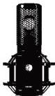

INKORANYAMUGA YIKORANABUHANGA

kayungurura urumuri cyangwa amabara mbere y'uko amashusho afatwa.

**Akazamuriro** (akazaamuuriro). Eng: Scroll bar. Fr: Barre de défilement. NK: Ikoranabuhanga rya mudasobwa. SH: Akarongo gashyirwa mu ruhande rwa mudasobwa kerekana uko ukoresha mudasobwa ari kuzamura cyangwa se amanura urupapuro rwe.

**Akugara k'indangururamajwi** (akûugaarâ k'iindâangururamajwi). HI: Akugara (akûugaarâ). Eng: Diaphragm. Fr: Diaphragme. NK: Ikoranabuhanga ry'amajwi. SH: Akantu kizengurukije gashobora kwikunja kaba mu ndangururamajwi cyangwa mu muzindaro kagatuma byirangira bigatanga amajwi yumvikana kurushaho.

**Amabwiriza agenga ukugera ku makuru** (amabwiiriza agêenga ukugera ku makurû). Eng: Access control protocol; controlled access protocol. Fr: Protocole d'accès contrôlé. NK: Ikoranabuhanga rya mudasobwa. SH: Ikintu shingiro mu mutekano w'amakuru, kigena ufite uburenganzira bwo kugera ku makuru no ku mutungo w'ikigo, no kubikoresha.

**Amabwiriza akwemerera kugera ku makuru** (amabwiiriza akwêemerera ukugera ku makurû). Eng: Data access protocol. Fr: Protocole d'accès aux données. NK: Ikoranabuhanga rya mudasobwa. SH: Amategeko atuma inkoranabuhanga zitandukanye n'inzungano bihana amakuru bigasangira amakuru kuri murandasi.

**Amabwiriza nyoborantima** (amabwiiriza nyôborantîma). Eng: Microinstruction. Fr: Micro-instruction. NK: Ikoranabuhanga rya mudasobwa. SH: Itegeko rya mudasobwa rikoresha imiyoboro ikenewe kugira ngo habashe gukorwa igikorwa kimwe cy'umurimo wa mudasobwa, cyane cyane mu gihe hakorwa itegeko ryo mu rurimi rwa mashini.

**Amabwiriza nyoherezamakuru** (amabwiiriza nyôherezamâkurû). HI: Imbonezanzira njyanabutumwa (imbonezanzira njyâanabûtumwâ). Eng: Hypertext Transfer Protocol Secure (https). Fr: Protocole de transfert hypertex sécurisé (https); protocole HTTP. NK: Ikoranabuhanga rya murandasi. SH: Ishingiro rya murandasi rikoreshwa mu gushyira ibintu