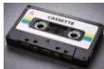
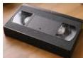

INKORANYAMUGA YIKORANABUHANGA

ibiranga ibikorwa by'imbaraminsi isanzwe ikoresha udupapuro, inyandiko iri mu mabara, cyangwa imigereka.

**Kanda** (ikaanda). Eng: Click. Fr: Clic; bouton. NK: Ikoranabuhanga rya mudasobwa. SH: Igikorwa cyo gukanda cyangwa kurekura ibuto y'imbeba, akenshi bikorewe kuri mudasobwa.

**Kanda ukurure** (kaanda ukurûre). HI: Kanda-unyereze (kaanda unyerêze). Eng: Click and drag. Fr: Clic et déplacer. NK: Ikoranabuhanga rya mudasobwa. SH: Gukoresha igikoresho ngaragaza nk'imbeba, kugira ngo ujishe indangagikorwa ku irebero hanyuma uyimurire ahandi wifuza.

**Kandakabiri** (ikaandakabiri). HI: Gukanda kabiri wungikanya (gukaanda kabiri wûungiikanya). Eng: Double click. Fr: Double clic; double-cliquer. NK: Ikoranabuhanga rya mudasobwa. SH: Igikorwa cyo ku mbeba ya mudasobwa aho uyikoresha akanda akanarekura vuba (akanda kabiri yihuta), agakanda agace k'ibumoso k'imbeba, akabigira kabiri gakurikiranye.

**Kaseti** (kaseêti). Eng: Tape; Tape storage; Magnetic tape storage. Fr: Cassette; bande magnétique. NK: Ikoranabuhanga rya mudasobwa. SH: Igikoresho gifite umumaro wo kubika no gushyingura amakuru ku gihe kirekre hifashishijwe ikidongi cy'umugozi ubikwaho amajwi, amashusho cyangwa byombi, bikaba byasomwa mu byiciro.

**Kaseti videwo** (kaseêti videwo). Eng: Video Tape. Fr: Casette video. NK: Ikoranabuhanga rya mudasobwa. SH: Kaseti ikoreshwa mu kubika amashusho n'amajwi, haba ari kuri televiziyo cyangwa se amashusho bwite.

**Kirobiti ku isogonda** (kirobiiti ku iisôgoondâ). Eng: Kilo Bits Per Second (Kbps). Fr: Un kilobit par seconde. NK: Ikoranabuhanga rya mudasi. SH: Igipimo kifashishwa mu gupima umuvuduko w'amakuru, bingana na biti 1000/ isegonda.

**Kode ndangarubuga y'igihugu** (koôde ndāangarûbuga y'igihûgu). Eng: Country Code Top-Level Domain (ccTLD). Fr: Domaine de premier niveau géographique. NK: Ikoranabuhanga rya mudasobwa. SH: Izina

181