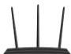
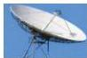

INKORANYAMUGA YIKORANABUHANGA

y'iyo mudasobwa yikoresha hagati yabyo hatagize undi wa gatatu uzamo kandi igisubizo kikaba cyizewe ko ari cyo.

Amasezerano nsangiramakuru (amasezerano y'isāangiramākurū). Eng: Data Sharing Agreement. Fr: Accord de partage de données (DSA). NK: Itumanaho koranabuhanga. SH: Ubwumvikane hagati y'inzego agaragaza uburyo amakuru akoreshwa, asangirwa, kandi arindwa.

Amashusho mbonankubone (amashusho mbōnankūbonē). Videwo mbonankubone (videwo mbōnankūbonē). Eng: Live video; livestream. Fr: Vidéo en direct. NK: Ikoranabuhanga rya mudasobwa. SH: Uburyo bwo gusakaza amashusho mu gihe nyacyo.

Amashusho mpuzabiganiro (amashusho mpuuzabigaaniiro). Eng: Interactive video (IV). Fr: Vidéo interactive. NK: Ikoranabuhanga rya mudasobwa. SH: Videwo koranabuhanga ishyira imbere kuganira n'ukoresha mudasobwa.

Amashusho mu isegonda (amashusho mu iisegondā). Eng: Frames Per Second (FPS). Fr: Images par seconde. NK: Ikoranabuhanga rya mudasobwa. SH: Igipimo cy'umuvuduko umukino w'amashusho koranabuhanga ushobora gukoreraho ukanagaragaza amashusho.

Amayinite (amayinite). Eng: Airtime credit; Prepaid mobile plan; Mobile airtime; Airtime payment; Airtime charge. Fr: Crédit de communication; credit; temps d'antenne. NK: Ikoranabuhanga rya mudasobwa. SH: Uburyo bwahanzwe bw'amafaranga akoreshwa kuri telefoni aho umuntu atanga amafaranga agahabwa igihe cyo kuvugira kuri telefoni ye.

Anteni (anteeni). Eng: Antenna; Aerial. Fr: Antenne. NK: Itumanaho koranabuhanga. SH: Ikoranabuhanga ryifashishwa mu kwakira cyangwa kohereza imiraba y'itumanaho nk'iya radiyo, televiziyo, telefoni zigendanwa, interineti cyangwa itumanaho nziramugozi.

Anteni nyabyerekezo (anteeni nyabyerekezo). Eng: Omnidirectional antenna. Fr: Antenne omnidirectionnelle. NK: Itumanaho koranabuhanga. SH: Ubwoko w'anteni yakira imiraba nsakazamakuru ituruka mu byerekezo byose.

