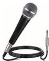

INKORANYAMUGA YIKORANABUHANGA

Megaheritse (megaheritse). Eng: Megahertz. Fr: Mégahertz. NK: Ikoranabuhanga rya mudasobwa. SH: Igipimo cy'ubwisubiremo bw'amajwi, bingana n'inshuro miliyoni ku isegonda.

Meni yo gutangira (meni yô gutâangira). HI: Ingingo y'ihagurutsa (ingiingo y'ihâgurutsa). Eng: Start menu. Fr: Menu de démarrage; menu démarrer. NK: Ikoranabuhanga rya mudasobwa. SH: Igikoresho gitanga inzira igera kuri za gahunda, igenabikorwa, incapanyandiko n'ibindi.

Menya n'ibindi (menya n'ibiindi). Eng: Learn More. Fr: Apprendre encore plus. NK: Ikoranabuhanga rya mudasobwa. SH: Igikorwa cyo kumva cyangwa kumenya byinshi kurushaho.

Mikoro (mikoro). HI: Indangururamajwi (indâangururamâjwi). Eng: Microphone. Fr: Microphone. NK: Ikoranabuhanga ry'amajwi. SH: Indangururamajwi ifite ubushobozi buhambaye bwo gukurura amajwi, yifashishwa mu gufata amajwi yihariye mu yandi menshi ari kumvikana ahantu runaka.

Mikoro nyabyerekezo (mikoro nyabyêerekezo). Eng: Omnidirectional microphone. Fr: Microphone omnidirectionnel. NK: Ikoranabuhanga ry'amajwi. SH: Ubwoko bwa mikoro yakira amajwi ifata aturutse mmu byerekezo byose.

Mikoro nyacyerekezo (mikoro nyacyêerekezo). Eng: Unidirectional microphone. Fr: Microphone Unidirectionnel. NK: Ikoranabuhanga ry'amajwi. SH: Ubwoko bwa mikoro yakira gusa amajwi ifata aturutse gusa mu cyerekezo yerekejwemo.

Mikoro yambarwa (mikoro yaambârwa). Eng: Lapel microphone, lavalier microphone, tie-clip microphone, clip mic; body mic; collar mic; neck mic. Fr: Micro-cravate, micro-corps; micro-collier; micro-cou. NK: Ikoranabuhanga ry'amajwi. SH: Ubwoko bwa mikoro nto yakira amajwi aturutse mu byerekezo byose, ikaba yakwambarwa ku gice cy'umwenda kiri hafi y'umunwa cyangwa igashyirwa ku kintu kiri hafi y'aho abantu bavugira.