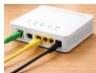

INKORANYAMUGA YIKORANABUHANGA

Minimagisi (minimagisi). Eng: Minimax. Fr: Minimax. NK: Ubwenge buhangano. SH: Amabwiriza akoreshwa mu nkoranabuhanga no mu gukora imikino.

Modemu ngendanwa inyaruka (moděemu ngeendānwa inyāruka). Eng: Mobile broadband modem; wireless modem; cellular modem. Fr: Modem à haut débit; modem sans fil; modem cellulaire. NK: Ikoranabuhanga rya murandasi. SH: Ubwoko bwa modemu butuma mudasobwa bwite cyangwa intanganzira byakira murandasi nziramugozi biciye mu ihuzanzira ngendanwa ryihuta aho gukoresha imiyoboro ya telefoni cyangwa ya televiziyo hakoreshejwe imigozi.

Modemu nkoranabuhanga (moděemu nkōranabūhaānga). Eng: Digital Modem. Fr: Modem numérique. NK: Ikoranabuhanga rya murandasi. SH: Igice cy'urwungano gituma itumanaho rishoboka biciye mu bikoresho nyakira koranabuhanga, kigashyikirana n'urwungano ruri kure ndetse kikaba cyafata ihuzanzira rusange biciye mu bikoresho bisanzwe bitari koranabuhanga.

Modemu nkoreshacyogajuru (moděemu nkoreeshacyoogajuru). Eng: Satellite Modem; satmodem. Fr: Modem satellite; satmodem. NK: Ikoranabuhanga rya murandasi. SH: Modemu ikoreshwa mu gushyiraho uburyo bwo kohereza amakuru hakoresheshejwe icyogajuru cy'itumanaho nk'impererekanyamakuru.

Modemu nkoreshamugozi (moděemu nkōreeshamūgozi). Eng: Cable Modem. Fr: Modem câble. NK: Ikoranabuhanga rya murandasi. SH: Igikoresho gicomeka urwungano koranabuhanga kuri murandasi binyuze mu muyoboro wa televiziyo hifashishijwe urusinga.

Modemu ntwarajwi (moděemu ntwāarajwī). Eng: Dial-up Modem; dial-up Internet access. Fr: Dial-up Modem; accès Internet par ligne commutée. NK: Ikoranabuhanga rya murandasi. SH: Ifata ihuzanzira biciye mu ihuzanzira rya telefoni rusange zahinduwe hagamijwe gukora ifatishahuzanzira ku utanga ihuzanzira hakoreshejwe kwandika nimero ya telefoni ku murongo usanzwe.

Modemu ya bugufi (moděemu ya būgufi). Eng: Limited distance modem. Fr: Modem à distance limitée. NK: Ikoranabuhanga rya murandasi. SH: Imashini yohereza amakuru mu buryo bugufi bwohereza