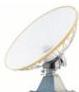
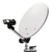
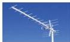

INKORANYAMUGA YIKORANABUHANGA

**Anteni nyacyerekezo** (anteeni nyacyerekezo). Eng: Unidirectional antenna. Fr: Antenne Unidirectionnelle. NK: Itumanaho koranabuhanga. SH: Ubwoko w'anteni yakira imiraba nsakazamakuru ituruka gusa ku cyerekezo yerekejweho.

**Anteni y'icyogajuru** (anteeni y'icyoogajuru). Eng: Satellite antenna. Fr: Antenne satellite. NK: Itumanaho koranabuhanga. SH: Igikoresho gishyirwa hanze cyangwa hejuru y'inzu kugira ngo gihure n'umuraba w'icyogajuru mu kirere, kikakira cyangwa kigashyira hanze ibimenyetso by'itumanaho.

**Anteni y'icyogajuru y'umweru** (anteeni y'icyoogajuru y'uumweeru). Eng: White Satellite Antenna. Fr: Antenne Satellite Blanche. NK: Itumanaho koranabuhanga. SH: Ubwoko bw'anteni y'igisahani ifite ibara ry'umweru ikoreshwa mu kwakira no kohereza imiraba y'itumanaho hagati y'Isi n'icyogajuru cy'itumanaho kiri mu kirere, ku buryo ibasha kwihanganira ubushyuhe bwinshi n'imihindagurikire y'ikirere.

**Anteni y'icyogajuru yo ku butaka** (anteeni y'icyoogajuru yô ku butaka). Eng: Earth station antenna; Ground satellite antenna. Fr: Antenne de station terrestre; Antenne satellite terrestre. NK: Itumanaho koranabuhanga. SH: Ubwoko bw'anteni nini iba ku butaka yakira kandi ikohereza imiraba y'itumanaho hagati yayo n'icyogajuru kiri mu kirere.

**Anteni y'igisahani** (anteeni y'igisahaani). HI: Anteni y'ikidasesa (anteeni y'ikidāsēesā). Eng: Satellite dish antenna; Parabolic antenna. Fr: Antenne Parabolique. NK: Itumanaho koranabuhanga. SH: Ubwoko bw'anteni ifite ishusho nk'iyisahani ishyirwa hanze y'inzu cyangwa ku nkingi, igakoreshwa mu kwakira no kohereza imiraba nsakazamakuru hagati y'ibikoresho by'itumanaho n'icyogajuru kiri mu kirere, ishobora kwakira cyangwa kohereza ibimenyetso nsakazamakuru bya radiyo mu buryo bw'uruhande rwose, bivuze ko itayobora ku cyerekezo kimwe gusa.

**Anteni y'udushami** (anteeni y'udushāmi). Eng: Directional antenna; Yagi antenna. Fr: Antenne directionnelle; antenne Yagi. NK: Itumanaho koranabuhanga. SH: Igikoresho mfamajwi cyangwa

