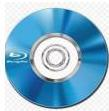
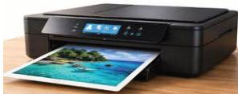

INKORANYAMUGA YIKORANABUHANGA

abantu bose yakozwe n'ikigega Mozilla hamwe n'isosiyete igikomokaho Mozilla Corporation.

**Mubazi koranabuhanga** (mubazi kōranabuhaānga). Eng: Electronic calculator. Fr: Calculatrice électronique. NK: Ikoranabuhanga rya mudasobwa. SH: Inkoranabuhanga ishobora gukora ibikorwa byo kubara nko guteranya, gukuba, gukuramo cyangwa kugabanya hakoreshejwe inzira koranabuhanga n'igenamikorere ya nkoranabuhanga.

**Mubitsi** (mubīitsi). Eng: C drive; Filing Cabinet. Fr: Disque C; armoire de classement. NK: Ikoranabuhanga rya mudasobwa. SH: Ahantu nyamukuru ho kubika amakuru muri mudasobwa, ikabikwamo sisitemu n'amadosiye, nk'akabati kabikwamo impapuro.

**Mubitsi ya Bulureyi** (mubīitsi ya Bulureyi). HI: Disike ya Blu-ray (diisiki ya Blu-ray); Imbikamakuru ruziga ya Blu-ray (imbīikamākurū ya Blu-ray). Eng: Blu-ray disk; Blu-ray. Fr: disque Blu-ray; Blu-ray. NK: Ikoranabuhanga rya mudasobwa. SH: Ubwoko bw'imbikamakuru ruziga nsomesharumuri bubika

amakuru menshi bwaje busimbura DVD, bukagira amashusho meza (1080p) cyangwa arenzeho (4K) bushobora no kubika ubundi bwoko bw'amakuru nyamibare.

**Mucapyi** (mucapyi). HI: Insoharanyandiko (insohoranyandiko). Eng: Printer. Fr: Imprimante. NK: Ikoranabuhanga rya mudasobwa. SH: Igikoresho

cyandukura inyandiko n'amashusho ku mpapuro cyangwa ibindi bikoresho kiba gicometse kuri mudsobwa, bityo kigafasha gusesengura inyandiko, inyandiko nyamibare, n'izindi gahunda kugira ngo hakorwe inyandiko n'amashusho bicapye bishyashya.

**Mucumbikirarubuga** (mucūumbikirarūbuga). Eng: Web hosting provider. Fr: Fournisseur d'hébergement web. NK: Ikoranabuhanga rya mudasobwa. SH: Ikigo cyangwa se abantu bafasha ibigo by'ubucuruzi n'abikorera bose babyifuza gufungura urubuga kuri murandasi.

192