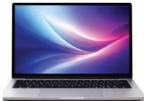

INKORANYAMUGA YIKORANABUHANGA

Mudasobwa (mudasobwa). Eng: Computer. Fr: Ordinateur. NK: Ikoranabuhanga rya mudasobwa. SH: Igikoresho koranabuhanga cyakira amakuru ku buryo bw'imibare kikabihindura ku buryo kibona igisubizo hakoreshejwe gahunda, inkoranabuhanga cyangwa itsinda ry'amategeko bikibwira ibigomba gukorwa.

Mudasobwa bwite (mudasobwa bwiite). Eng: Personal computer (PC). Fr: Ordinateur personnel. NK: Ikoranabuhanga rya mudasobwa. SH: Igikoresho cy'ikoranabuhanga cyakorewe gukoreshwa n'umuntu ku giti cye haba ari akazi gasanzwe, imikino ya videwo cyangwa gushaka amakuru kuri murandasi, kikagira indongozi ya mudasobwa, intima, imbikamakuru, umwanya wo kubikamo amakuru, ibikoresho nyinjiza cyangwa nsohoramakuru (indebero, urwandikiro n'imbeba).

Mudasobwa itagendanwa (mudasobwa itageendánwa). HI: Mudasobwa bwite (mudasobwa bwiite). Eng: Individual computer; Personal computer; Desktop PC. Fr: Ordinateur individual; ordinateur de bureau. NK: Ikoranabuhanga rya mudasobwa. SH: Igikoresho icyo ari cyo cyose kigamije kubara gikoreshwa n'umukoresha w'umuntu ku bw'inyungu z'umukoresha.

Mudasobwa musabyi (mudasobwa musabyi). Eng: Client Computer; Client. Fr: Ordinateur client; Client. NK: Ikoranabuhanga rya mudasobwa. SH: Igikoresho cy'ikoranabuhanga cya mudasobwa kibona amakuru gikuye ku yindi mudasobwa yitwa ikigega cy'amakuru mu rwego rw'ibonezanzira hagati y'ikigega n'imashini ihabwa amakuru yo ku ihuzanzira koranabuhanga.

Mudasobwa ngendanwa (mudasobwa ngeendánwa). HI: Mudasobwa igendanwa (mudasobwa igéendanwa). Eng: Laptop computer; laptop. Fr: Ordinateur portable. NK: Ikoranabuhanga rya mudasobwa. SH: Igikoresho cya mudasobwa nto ishobora kugendanwa cyangwa umuntu

akayikoresha iri ku bibero, ifite irebero n'urwandikiro rurimo imbeba, irebero n'urwandikiro bikora ikintu kimwe gihinwa ku buryo irebero ripfundikira urwandikiro, igakora nka mudasobwa isanzwe, ikagira

193