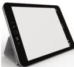
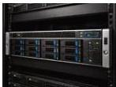

INKORANYAMUGA YIKORANABUHANGA

akarusho ko gukora idacometse ku mashanyarazi igihe runaka kuko iba ikoresha ayo ifite muri batiri.

**Mudasobwa ngendanwa nto** (mudāsobwa ngeendānwa ntō). HI: (indeebero nkōranabūhaānga). Eng: Tablet; touchscreen. Fr: Tablette; Tablette tactile. NK: Ikoranabuhanga rya mudasobwa. SH: Mudasobwa bwite ngendanwa nziramugozi ifite indebero nkoranabuhanga yumva urutoki, iba ari nto kuri mudasobwa isanzwe ariko ikaba nini ho gato kuri telefoni igezweho (simatifoni), uruhande rw’imbere rwose ni ikirahure cyumva ugikabakabye ku buryo ahashinzwe urutoki ireba ubutumwa buhasanzwe ukanze aba avuze ikabukurikiza, icyo kirahure ni irebero n’urwandikiro.

**Mudasobwa remezo** (mudāsobwā remezo). Eng: Mainframe computer; mainframe; big iron. Fr: Ordinateur central. NK: Ikoranabuhanga rya mudasobwa. SH: Urwungano rugari rwa mudasobwa rufite ubushobozi bwo gukoreshwa mu bikoresho by’ikoranabuhanga bifite ububiko buhanitse, n’ibigarura amakuru yatakaye ndetse no mu zindi porogaramu kandi bikorewe icyarimwe.

**Mudasobwa rukomatanyo** (mudāsobwā rukomatanyo). Eng: All-in-One PC. Fr: Ordinateur tout-en-un. NK: Ikoranabuhanga rya mudasobwa. SH: Mudasobwa ziba zifite isanduku ya mudasobwa ifatanye na mugaragaza.

**Mugabuzi** (mugabuzi). HI: Impuzamakuru (impūuzamākurū). Eng: Server; Server device. Fr: Serveur. NK: Ikoranabuhanga rya mudasobwa. SH: Mudasobwa cyangwa sisitemu nk’inkoranabuhanga cyangwa igikoresho cyo kubika bitanga ibyo gukoresha, amakuru, serivisi na gahunda bibiha izindi mudasobwa biciye mu ihuzanzira, bityo bibika amakuru, bikayohereza, bikanayakira, bikanakora n’indi mirimo.

**Mugabuzi y’ihuzanzira** (mugabuzi y’ihuzanzira). Eng: Network Server. Fr: Serveur réseau. NK: Ikoranabuhanga rya murandasi. SH: Mudasobwa ifasha ibikorwa by’ihuzanzira gukora ndetse ikagena n’imikorere yabyo y’ibanze.

194