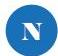

INKORANYAMUGA YIKORANABUHANGA

ku buryo umuntu ufite ubumuga bwo kutabona akoraho agasoma ibyanditse.

Negatifu (negatiifu). HI: Imbanzirizafoto (imbaanzirizafoto). Eng: Latent image. Fr: Image latente. NK: Ikoranabuhanga rya mudasobwa. SH: Ishusho yafashwe gusa itabona neza, ikaba mu gihe itunganyijwe yavamo ishusho nzima.

Nomero ndangamuntu y'Igihugu (nomero ndaangamuuntu y'igihugu). Eng: National identification number. Fr: Numéro d'identification national. NK: Ikoranabuhanga ndangamuntu. SH: Nomero iranga umuntu ishyirwaho ku buryo bwa tombola, yihariye kandi ihoraho ihabwa umuntu wanditswe muri CRVS bikozwe n'umukozi ubishinzwe.

Nomero ya SDID (nomero ya SDID). Eng: Single Digital Identification number; SDID number. Fr: Numéro SDID. NK: Ikoranabuhanga ndangamuntu. SH: Nomero y'indangamuntu koranabuhanga, ari yo nomero itangwa mu buryo bwa tombola, yihariye kandi ihoraho, iranga umuntu wayihawe.

Nyabubiri (nyabubiri). Eng: Binary. Fr: Binaire. NK: Ikoranabuhanga rya mudasobwa. SH: Urwungano nyamibare rwa mudasobwa rukoresha imibarwa ibiri 0 na 1 (igicumbi 2) rukoreshwa mu kubika amakuru no kubara ingiro, akaba ari urwungano shingiro mu ihunika ry'amakuru kuko ari ho isesengurira amakuru ikagaragaza byose, yaba ari inyandiko, imibare, amabwiriza, amashusho byose mu buryo bw'amatsinda agizwe n'iriya mibarwa ibiri.

Nyamiraba (nyamiraba). Eng: Analog. Fr: Analogique. NK: Ikoranabuhanga rya mudasobwa. SH: Iigikoresho kiri mu bwoko aho ingano zihoraho zihindagurika, nk'ubushobozi bw'amashanyarazi, umuvuduko w'amazi, cyangwa ingendo za mekanike, zigaragazwa mu buryo busa n'ingano zijyanye n'ikibazo kigomba gukemurwa.

Nyamugozi (nyamagozi). HI: Ihuzanzira ngiramugozi (ihuuzanzira ngiramugozi). Eng: Ethernet; Hardwired connection. Fr: Ethernet; Connexion câblée. NK: Ikoranabuhanga rya mudasobwa. SH:

198