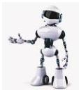

INKORANYAMUGA YIKORANABUHANGA

Ikoranabuhanga ry'itumanaho rihuza mudasobwa n'ibindi bikoresho mu muyoboro wo mu gace kamwe (LAN) hifashishijwe insinga, bikabafasha guhanahana amakuru ku muvuduko mwinshi.

**Nyamwikoresha** (nyamwiikoreesha). HI: Robo (robo). Eng: Robot; Bot. Fr: Robot; bot. NK: **Ubwenge buhangano**. SH: Inkoranabuhanga nkoreshwa yikoresha ishobora gukurikiza amategeko amwe namwe ihawe iyo yinjijwemo ubutumwa runaka, igakoreshwa mu bikorwa bigaruka kenshi kandi buri kanya, igakora yigana umuntu cyangwa ikamusimbura kandi ikabikora neza kumurusha, byaba bigambiriye ikiza cyangwa ikibi.

**Nyamwikoresha nsubiza** (nyamwiikoreesha nsubiza). Eng: Autoresponder. Fr: Répondeur automatique. NK: Ikoranabuhanga rya mudasobwa. SH: Porogaramu cyangwa inyandiko kuri seriveri ya imeri isubiza imeri mu buryo bwikora.

**Nyiramubande** (nyirāmubāandē). Eng: Echo. Fr: Écho. NK: Ikoranabuhanga rya mudasobwa. SH: Ukwisubiramo gutandukanya amajwi bitewe n'aho asekuye, nko ku rukuta, cyangwa no ku musozi, bibaho no mu majwi ya mudasobwa.

**Nyiramubande** (nyirāmubāandē). HI: Ubuduha (ubuduuha). Eng: Acoustical feedback. Fr: Retour acoustique. NK: Ikoranabuhanga rya mudasobwa. SH: Ijwi ry'ubuduha ritangwa no guhungabana kw'amajwi gutewe n'uko indangururamajwi yakiriye amajwi ava ku nsakazamajwi irigushyira bityo amajwi akinyuramo kugeza insakazamajwi itakibasha kuyakira.

**Nyiri amakuru** (nyirī amakurū). Eng: Data subject. Fr: Personne fichée; personne concernée. NK: Ikoranabuhanga ndangamuntu. SH: umuntu runaka ufitanye isano n'amakuru runaka.

**Nyirubwite** (nyirūbwīite). HI: Nyiri amakuru (nyirī amakurū). Eng: Data subject. Fr: Personne fichée; personne concernée. NK: Ikoranabuhanga ndangamuntu. SH: Umuntu usanga amakuru ye bwite yarakusanyijwe kandi agatunganywa.