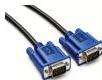
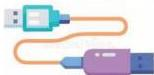

INKORANYAMUGA YIKORANABUHANGA

Umugenga w'imeri (umugeënga w'íimêeri). Eng: Mail transfer agent (MTA); message transfer agent; mail relay. Fr: Agent de transfert de courrier; agent de transfert de messages (MTA); relais de courrier. NK: Ikoranabuhanga rya mudasobwa. SH: Porogaramu ya mudasobwa igenga uburyo ubutumwa bwa imeyiri busakazwa ku ihuzanzira.

Umugenzuzi w'amakuru (umugeenzuuzi w'āmakurū). Eng: Data controller. Fr: Contrôleur de données. NK: Ikoranabuhanga rya mudasobwa. SH: Umuntu usaba, ukusanya, uhuza, ucunga cyangwa ubika amakuru ya nyir'ubwite hakoreshejwe ikoranabuhanga.

Umugenzuzi w'amakuru y'ubucuruzi (umugeenzuuzi w'āmakuru y'ūbucūruuzi). Eng: Sales data controller (SDC). Fr: Responsible du traitement des données commerciales. NK: Ikoranabuhanga ry'imari. SH: Umukozi ugenzura imigendekere y'ubucuruzi, haba mu kwiga isoko, kugenzura urwunguko cyangwa igihombo cy'isosiyete.

Umugereka (umugêrekā). HI: Ubutumwa mushandiko (ubutumwā mushāandiko). Eng: File attachment. Fr: Pièce jointe. NK: Itumanaho koranabuhanga. SH: Amafishiye yinjijwe mu nzira z'itumanaho ziri kuri murandasi, twavuga nka imeri, ubutumwa buhutiyeho n'imbuga nkoranyambaga, ashobora kuba amashusho, inyandiko cyangwa za gahunda z'ikoranabuhanga.

Umugozi ntwaramakuru w'indebero (umugozī ntwāaramākurū w'īndeebero). Eng: VGA cable. Fr: Câble VGA. NK: Ikoranabuhanga rya mudasobwa. SH: Umugozi uhuza intima (CPU) n'indebero ufite utwinyo twinshi.

Umugozi wa HDMI (umugozī wa HDMI). Eng: High-Definition Multimedia Interface (HDMI). Fr: Interface multimédia haute définition. NK: Ikoranabuhanga rya mudasobwa. SH: Ubwoko bw'umugozi uhuza mudasobwa n'indebero ya televiziyo zigezweho.

Umugozi wa USB (umugozī wa USB). Eng: Universal Serial Bus Cable (USB). Fr: Cable USB. NK: Ikoranabuhanga rya mudasobwa. SH: Urwungano rwo gucomeka ikoranabuhanga rya mudasobwa ku bindi nka mudasobwa n'ibikoresho nka telefone, mwandikisho, imbeba, mucapyi n'ibindi bikoresho by'imbikamakuru,

