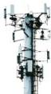

INKORANYAMUGA Y'IKORANABUHANGA

igezweho (simatifoni) biri kuri murandasi biciye mu ihuzanzira rya hafi cyangwa hadakoreshejwe murandasi.

**Umukono koranabuhanga** (umukonō kōranabūhaānga). Eng: Electronic signature; e-signature; digital signature. Fr: Signature électronique; Signature numérique. NK: Ikoranabuhanga rya mudasobwa. SH: Ijambo ryagutse ku bikorwa byose by' ikoranabuhanga byerekana ko yemeye amasezerano cyangwa inyandiko.

**Umukoro w'ikoranabuhanga** (umukōro w'ikōranabūhaānga). Eng: IT task; task. Fr: Tâche informatique. NK: Ikoranabuhanga rya mudasobwa. SH: Umurimo cyangwa igikorwa cy'umwihariko gishyirwa mu ngiro hifashishijwe inzungano koranabuhanga n'ikoranabuhanga nyunganizi.

**Umunara** (umunara). Eng: Tower unit; Tower. Fr: Tour. NK: Ikoranabuhanga rya mudasobwa. SH: Icyubakwa kirekire cyane, cyubakishijwe ibyuma, akenshi gisize amabara y'umweru n'umutuku gishinzwe gufata ubutumwa bw'igikoresho k'itumanaho kiri hafi kikabwohereza ku kindi gikoresho kiri ahandi hantu kure.

**Umunara wa telefoni** (umunara wa telefooni). Eng: Cellular tower; cellur site. Fr: Tour de téléphonie cellulaire; site cellulaire. NK: Itumanaho koranabuhanga. SH: Ahantu hubatse ibikoresho by'itumanaho bikoresha amashanyarazi n'anteni bituma hafi aho abantu bakoresha ibyuma by'itumanaho nziramugozi nka telefoni na radiyo.

**Umunara w'itumanaho** (umunara w'iitūmanahō). Eng: Telecommunication tower. Fr: Tour de télécommunication. NK: Ikoranabuhanga rya murandasi. SH: Inyubako ishyirwaho anteni n'ibindi bikoresho by'itumanaho nziramugozi usanga ari ingenzi mu gutanga serivisi z'itumanaho nziramugozi zizewe kandi rusange.

**Umuraba** (umurāba). Eng: Wave; radio wave; signal. Fr: Onde; onde radio; signal. NK: Ikoranabuhanga rya mudasobwa. SH: Ikimenyetso cya elegitoroniki kijyana amakuru, akenshi haba havugwa umuraba wa radiyo kuko utangiza umubiri w'umuntu, bityo ukaba ari wo mwiza mu itumanaho.

**Umuraba nsuzumashusho w'urwunge** (umurāba nsuuzumashusho w'ūrwuūnge). Eng: Multiburst signal; multiburst waveform. Fr: Signal