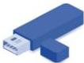

INKORANYAMUGA YIKORANABUHANGA

Furashi (furaāshi). HI: Imbikamakuru nto (imbīkamākurū nto); imbitsi ngendanwa (imbītsi ngeendōnwa); disike ngendanwa (diisīke ngeendānwa); furashi disiki (furaāshi diīsiki); Imbikamakuru USB (imbīkamākurū USB). Eng:

USB drive; USB flash drive; flash drive; Flash disk; USB memory stick; flash disk; flash; USB Memory Key; Flash memory drive; Keychain drive; Thumb drive; Pen drive; Jump drive; Storage chip. Fr: Clé USB; Mémoire disk; clé mémoire USB; clé USB porte-clés; Puce de stockage. NK: Ikoranabuhanga rya mudasobwa. SH: Igikoresho gito cyitwazwa gicomekwa kuri mudasobwa cyangwa ku bindi bikoresho hakoreshejwe inzira USB yo mu rwego rwa A iba yubakiyemo mu nsomamakuru, kibikwamo ibintu igihe kirekire kandi ntibizimire niyo umuriro wagenda, ikoreshwa cyane mu nzungano zubatse muri mudasobwa, ikaba yarakozwe haherewe ku mbikamakuru ishobora guhindurirwa ururimi cyangwa igahanagurwa.

Gihamya koranabuhanga (gihamyā kōranabūhaānga). Eng: Digital Evidence. Fr: Preuve numérique. NK: Ikoranabuhanga ngaragazabimenyetso. SH: Amakuru ayo ari yo yose yashyinguwe cyangwa yoherejwe ku buryo bw’ikoranabuhanga, akaba yakoreshwa mu rwego rwo gushaka amakuru yifashishwa n’ubutabera cyangwa y’ubushinjacyaha.

Gihamya mvamuyoboro (gihamyā mvāamuyoboro). HI: Gihamya yo mu ihuzanzira (gihamyā yō mu iihuuzanzira). Eng: Evidence; Network-based Evidence. Fr: Preuve; preuve du réseau. NK: Ikoranabuhanga rya mudasobwa. SH: Amakuru ayo ari yo yose akurwa mu bikorwa byo ku ihuzanzira akoreshwa mu kugaragaza cyangwa mu guhakana ikintu gikekwa ko cyabaye mu rwego rwo gushaka amakuru yifashishwa n’ubutabera cyangwa y’ubushinjacyaha.

Gucapura (gucapura). Eng: Print. Fr: Imprimer. NK: Ikoranabuhanga rya mudasobwa. SH: Igikorwa cyo kohereza inyandiko muri mucapyi kugira ngo isohoke ku mpapuro.