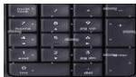

INKORANYAMUGA YIKORANABUHANGA

Urwandikiro nyamibare (urwaandikiro nyamibarê). Eng: Numeric keyboard. Fr: Clavier numérique. NK: Ikoranabuhanga rya mudasobwa. SH: Urutonde rugizwe n'imibare guhera kuri 0 kugera ku 9, rwifashishwa na mudasobwa mu kwandika amakuru agizwe n'imibare.

Urwandikiro rworoshye (urwaandikiro rwoorôshye). Eng: Membrane keyboard. Fr: Clavier à membrane. NK: Ikoranabuhanga rya mudasobwa. SH: Ikibaho cya mudasobwa gikoze muri plasitiki cyangwa urundi rupapuro rukweduka, rufite ibimenyetso n'inyuguti na byo bikoze muri izo mpapuro.

Urwego ngengabikorwa rw'ibya telefoni (urwêego ngêengabikorwâ rw'ibyaa telefoôni). Eng: Telephony. Fr: Téléphonie. NK: Ikoranabuhanga rya mudasobwa. SH: Urwego rw'ikoranabuhanga rubarirwamo gukora ibijyanye n'itumanaho, kubigerageza no gukwirakwiza serivisi z'itumanaho hagamijwe iyoherezwa ry'imiraba nyamajwi, za fagisi n'amakuru hagati y'ibikoresho bitegeranye.

Urwego rugenzura (urwêego rugeenzûura). Eng: Supervisory authority. Fr: Autorité de contrôle. NK: Ikoranabuhanga rya mudasobwa. SH: Urwego rw'igihugu rufite mu nshingano umutekano w'ibijyanye n'ikoranabuhanga mu itangazabumenyi n'itumanaho.

Urwego rushinzwe iyandikambuga (urwêego rushiinzwê iyândikambûga). Eng: Top level domain registrar. Fr: Registraire du domaine de premier niveau. NK: Ikoranabuhanga ndangamuntu. SH: Uwahawe uruhushya n'urwego ngenzuramikorere rwo gucunga amazina ndangarubuga yagenwe.

Urwinjiriro rurinzwe rwa Wi-Fi (urwiinjiriro ruriinzwê rwaa wifi). Eng: Wi-Fi Protected Access (WPA). Fr: Accès protégé du Wi-Fi. NK: Ikoranabuhanga rya murandasi. SH: Inzira y'umutekano yagenewe gukora imiyoboro idafite insinga yizewe.

Urwinjiriro rw'ihuzanzira (urwiinjiriro rw'ihuuzanzira). Eng: Network tap. Fr: Dispositif d'accès-réseau. NK: Ikoranabuhanga rya mudasobwa. SH: Igikoresho gifatika gituma umuntu ashobora kugera ku makuru aca mu ihuzanzira koranabuhanga.