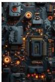

INKORANYAMUGA YIKORANABUHANGA

Urwungano ntima (urwuungaano ntima). HI: Ikarita ya mudasobwa (ikarita ya mudasobwa). Eng: Motherboard; Computer board; board. Fr: Carte-mère; carte mère; carte d'ordinateur; carte. NK: Ikoranabuhanga rya mudasobwa. SH: Igikoresho mwikorezi cya mudasobwa gituma ibindi bikoresho bihanahana amakuru hagati yabyo, ibyo ni nk'imbikamakuru, inshobozamudasobwa, ikarita y'amashusho n'ibindi bikoresho.

Urwungano ntima ry'ubwenge buhangano (urwuungaano ntima ry'uubwenge buhaangano). Eng: Neural processing unit (NPU). Fr: Unité de traitement neuronal. NK: Ubwenge buhangano. SH: Igice cyo gutunganya imitsi (NPU) y'igikoresho gifite imiterere isa n'urusobe rw'imitsi rw'ubwonko bw'umuntu.

Urwungano nyamiraba (urwuungaano nyamiraba). Eng: Microwave system; microwave link. Fr: Liaison micro-ondes. NK: Ikoranabuhanga rya mudasobwa. SH: sisitemu y'itumanaho ikoresha umuraba w'imirasire ya radiyo mu rwego rwa micro-onde frequency kugira ngo yohereze videwo, amajwi, cyangwa amakuru hagati y'ahantu habiri, hashobora kuba hagati ya metero cyangwa metero nke, cyangwa hagati ya kilometero cyangwa kilometero nyinshi.

Urwungano nyiganano (urwuungaano nyigaanano). Eng: Clone. Fr: Clone. NK: Ikoranabuhanga rya mudasobwa. SH: Ibikoresho cyangwa porogaramu byagenewe gukora kimwe cyangwa bisa cyane na sisitemu y'umwimerere.

Urwungano nyoboramikorere (urwuungaano nyoboramikorere). Eng: Operating system (OS). Fr: Système d'exploitation. NK: Ikoranabuhanga rya mudasobwa. SH: Gahunda icunga ibyo mudasobwa ikoresha cyane cyane igenamikoreshereze y'ibyo bintu mu zindi gahunda, ibyo bintu ni inshozamudasobwa, imbikamakuru ya mudasobwa, ibika ry'amafishiye, ibikoresho byohereza cyangwa bikura amakuru muri mudasobwa n'ihuzanzira.

Urwungano rukomatanyo (urwuungaano rukomatanyo). Eng: Embedded system. Fr: Système embarque. NK: Ikoranabuhanga rya mudasobwa. SH: sisitemu ya mudasobwa ishingiye kuri poroseseri nto