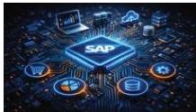

INKORANYAMUGA YIKORANABUHANGA

bya mudasobwa kandi igashyiramo porogaramu iyo mudasobwa ifunguye.

**Urwungano rwa mugabuzi** (urwuungaano rwaa mugabuzi). Eng: Network Operating System. Fr: Système d'exploitation; Réseau. NK: Ikoranabuhanga rya murandasi. SH: Itsinda rya mudasobwa ebyiri cyangwa nyinshi cyangwa ibindi bikoresho by'ikoranabuhanga bifitanye isano bikoreshwa hagamijwe guhana amakuru.

**Urwungano rwa mugabuzi** (urwuungaano rwaa mugabuzi). Eng: Server operating system. Fr: Système d'exploitation serveur. NK: Ikoranabuhanga rya mudasobwa. SH: Urwungano huzanzira rwa mugabuzi rwihariye rucunga amakuru mpuzanzira no

gutanga serivisi z'isangira ry'amafishiye, gucapa inyandiko no kubika inkoranabuhanga nkoresha zikenerwa n'abakiriya habariwemo abakoresha inzungano huzanzira zitandukanye.

**Urwungano rwa SAP** (urwuungaano rwaa SAP). Eng: Systems, Applications &amp; Products (SAP). Fr: Systèmes, applications et produits. NK: Ikoranabuhanga rya mudasobwa. SH: Urwungano ncungamirimo rukomatanyije rukoreshwa cyane mu

bigo, rugatuma buri rwego rw'umurimo rugera ku makuru rusange bakayasangira bigatuma buri mukozi akorera ahantu hari imikoranire ya buri munsi haba mu ibaruramari, igurisha, ikorabintu, icungwa ry'abakozi n'imari.

**Ushinzwe inkoranabuhanga** (uūshiinzwe inkōranabuhaānga). HI: Ushinzwe ikoranabuhanga (uūshiinzwe ikōranabuhanga). Eng: Systems administrator; IT administrator; system administrator; computer administrator; sysadmin; admin; Root. Fr: Administrateur de systèmes TIC; Administrateur informatique; administrateur du système; administrateur système; administrateur. NK: Ikoranabuhanga rya mudasobwa. SH: Umuntu urema itsinda rubugambaga kandi akaba afite ubushobozi bwo gushyiramo abantu cyangwa akabakuramo.