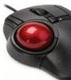

INKORANYAMUGA YIKORANABUHANGA

rw'ibikenerwa byifashishwa mu nzungano n'imikorere koranabuhanga harimo ibigenderwaho nk'ibiranga umukoreshabuhanga, inzira y'imikorere n'amakuru agenewe abaturage.

**Ibiro koranabuhanga** (ibiro kōranabūhaānga). Eng: Digital Workplace; Digital office Fr: Office digitale NK: Ikoranabuhanga rya mudasobwa. SH: Ahantu cyangwa uburyo byorohereza abantu gukora bifashishije ikoranabuhanga.

**Ibitabo byo kuri murandasi** (ibitabo byō kuri murāandasi). Eng: Electronic book (e-book). Fr: Livre électronique. NK: Ikoranabuhanga rya murandasi. SH: Inyandiko zidafatika zanditse mu buryo bw'igitabo zibikwa ku mbuga nkoranyambaga zabugenewe aho umuntu wujuje ibisabwa azibona yifashishije igikoresho cye k'ikoranabuhanga.

**Ibiye ndanga** (ibīye ndaanga). Eng: Trackball. Fr: Boule de commande. NK: Ikoranabuhanga rya mudasobwa. SH: Igikoresho gikozwe n'ibiye rishyigikiwe n'ikintu kirimo imfatamakuru zibona izunguruka ryaryo ku nsanganya (axe) ebyiri, kikaba gikoreshwa n'intoki mu kwimura akanyerezo ngaragazahantu ku irebero rya mudasobwa.

**Ibogama** (ibogama). Eng: Bias. Fr: Biais. NK: Ubwenge buhangano. SH: Ikosa riri hagati y'ukuri kw'ibiboneka n'ikomeza kugaruka rikaboneka mu rugero rwigirwaho nyirizina bitewe n'inkeko zikocamye mu rugendo rwo kwigiraho kwa mudasobwa.

**Ibonezabucuruzi koranabuhanga** (ibōnezabūcuruuzi kōranabūhaānga). Eng: Computer aided acquisition and logistic support; continuous acquisition and life cycle support. Fr: Soutien logistique intégré. NK: Ikoranabuhanga ry'imari. SH: Uburyo bw'ikoranabuhanga buhuza amakuru y'ihanga, ikora, iyamamaza n'igemura ry'ibicuruzwa no kubungabunga inganda.

**Ibonezamakuru** (ibōnezamākurū). Eng: Data organization; data organizing. Fr: Organisation des données. NK: Ikoranabuhanga rya mudasobwa. SH: Itondekanya mbonera ry'amakuru mu isura yubakitse kugira ngo horoshywe ishakisha, isesengura n'isobanura ryayo.