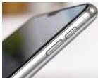

INKORANYAMUGA YIKORANABUHANGA

Ibuto mbarutso (ibuto mbārutso). HI: Imbarutso (imbārutso); buto yo kwatsa (buto yō kwaatsa), incanyi (incāanyi). Eng: Start button; Power button. Fr: Bouton de démarrage; bouton Démarrer; bouton d'alimentation. NK: Ikoranabuhanga rya mudasobwa. SH: Akantu ka mbere kuri mudasobwa bakanda iyo batsa cyangwa bazimya mudasobwa cyangwa ikindi gikoresho cy'ikoranabuhanga.

Ibuto ntangamabwiriza (ibuto ntāangamābwiiriza). Eng: Command button; Push button; Boutton. Fr: Bouton de commande; bouton poussoir; Bouton. NK: Ikoranabuhanga rya mudasobwa. SH: Igikoresho ngenzuzi giha uri gukoresha mudasobwa uburyo bworoshye bwo gutangiza igikorwa nko gushaka igisabwa mu nshakishamakuru cyangwa gukorana n'agatangazo menyesha, twavuga nko kwemeza igikorwa.

Ibuto yatsa ikanazimya (ibuto yaatsā ikanāzimya). HI: Akarango ko ku ruhande (akaraango kō ku ruhaände). Eng: Side button. Fr: Bouton latéral. NK: Ikoranabuhanga rya mudasobwa. SH: Akarango kaba ku ruhande rwa telefoni zigezweho cyangwa irebero mudasobwa, ikagira umumaro wo kwatsa no kuzimya cyangwa kongera no kugabanya ijwi, hari n'ubwo gahabwa undi mumaro, kuri mudasāobwa zo muri iki gihe aka karango kari mu mashini mo imbere, mu itendekamikorere.

Ibwiriza jwi (ibwiiriza jwī). HI: Ijwi ntegeka (ijwī ntegeka). Eng: Voice command. Fr: Commande vocale. NK: Ikoranabuhanga rya mudasobwa. SH: Amabwiriza atangwa n'ukoresha mudasobwa akoresheje ijwi kugira ngo inkoranabuhanga nkorabikorwa ikore umurimo runaka, bukaba ari uburyo umuntu aganiramo na robo mu buryo busa n'ikiganiro gisanzwe, bityo bikongera imikorere myiza n'uburyo bworoshye bwo gukoresha sisitemu bakoresheje ijwi ryabo aho gukoresha intoki.

26