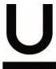

INKORANYAMUGA YIKORANABUHANGA

Icamurongo (icâamuroongo). Eng: Underline. Fr: Souligné. NK: Ikoranabuhanga rya mudasobwa. SH: Uburyo bwo gutunganya inyandiko bushyira umurongo munsi y'inyandiko.

Icapura ngaragazamubyimba (icapa ngâragazamûbyiimba). Eng: 3D Printing. Fr: Impression tridimensionnelle; Impression en 3D. NK: Ikoranabuhanga rya mudasobwa. SH: Uburyo bwo gukora ibintu bifatika bifite ingano eshatu hongerwaho ibikoresho ku byiciro hashingiwe ku gishushanyo cyo kuri mudasobwa.

Icimbura (icîimbura). Eng: Truncation. Fr: Troncation. NK: Ikoranabuhanga rya mudasobwa. SH: Imikorere cyangwa igikorwa cyo guhina cyangwa gukuraho igice cy'amakuru cyangwa amakuru amwe kugira ngo ugabanye uburebure cyangwa ubunini bwayo.

Icubira (icubira). Eng: Learning Regression; Regression. Fr: Régression d'apprentissage; régression. NK: Ubwenge buhangano. SH: Tekiniki yo kwigiraho kwa mudasobwa kugenzurwa gukoreshwa mu kugena agaciro gakurikirana hagamijwe kugena umurongo ugororotse cyangwa umurongo uhese nyamukuru hagati y'amakuru, umurongo mbonera ukagira ubwoko bw'ibipimo bitatu ari byo tandukaniro, icyama n'ikosa.

Icungajambo banga (icuungajaambo baanga). Eng: Password management. Fr: Gestion des mots de passe. NK: Ikoranabuhanga rya mudasobwa. SH: Gucunga ijambo ry'ibanga n'uruhererekane rw'amahame n'ibikorwa byiza abakoresha bagomba gukurikiza mu gihe babitse kandi bagacunga ijambo ry'ibanga neza kugira ngo babungabunge umutekano ushoboka kandi birinde kubuza kwinjira.

Icungamari koranabuhanga (icûungamâarâ kôranabûhaânga). Eng: Electronic finance. Fr: Finance électronique. NK: Ikoranabuhanga ry'imari. SH: Itangwa rya serivisi y'imari n'imikoranire y'amasoko y'imari hifashishijwe ikoranabuhanga ry'itumanaho n'iry'ikoranabuhanga rya mudasobwa.

Icungamakuru (icûungamâkurû). Eng: Data management. Fr: Gestion des données. NK: Ikoranabuhanga rya mudasobwa. SH: Uburyo bwo gucunga amakuru bikubiyemo gukusanya, kubika no gukoresha amakuru mu buryo bwizewe, bunoze.