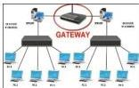

INKORANYAMUGA YIKORANABUHANGA

Icyago (icyāago). HI: Impanuka (impanuka); icyitonderwa (icyiitoonderwa). Eng: Hazard. Fr: Danger. NK: Ikoranabuhanga rya mudasobwa. SH: Ukuba urwungano rutari gukora neza bitewe n'ikibuza kitari giteganyijwe kibonetse kuri mudasobwa.

Icyaha cy'ikoranabuhanga (icyāaha cy'īkōranabūhaānga). Eng: Cybercrime. Fr: Cybercriminalité. NK: Ikoranabuhanga rya murandasi. SH: Igikorwa kitemewe n'amategeko gikorerwa kuri murandasi cyangwa hifashishijwe ikoranabuhanga.

Icyaha gikorewe kuri mudasobwa (icyāaha gikorēwe kurī mūdasobwā). Eng: Computer-related offence. Fr: Infractions liée à l'informatique. NK: Ikoranabuhanga rya mudasobwa. SH: Igikorwa kinyuranyije n'amategeko gikorwa hakoreshejwe mudasobwa cyangwa imiyoboro yayo.

Icyambu (icyaambu). HI: Ikiraro huzanzira (ikiraro huuzanzira); ipfundo huzanzira (ipfūundo huuzanzira). Eng: Gateway; Network Bridging; bridge. Fr: Passerelle; pont réseau; Pontage de réseau. NK: Ikoranabuhanga rya murandasi. SH: Ahahurirwa n'ihuzanzira

ritandukanye hakoreshwa mu itumanaho, hagahuza ihuzanzira ebyiri zifite imbonezanzira nyoherezamakuru zitandukanye.

Icyambu mpuzabubiko (icyaambu mpūuzabūbiiko). HI: Icyambu cya API (icyaambu cya API); irembo rya API (irēembo rya API). Eng: Application Programming Interface (API); API Gateway. Fr: Passerelle API. NK: Ikoranabuhanga rya mudasobwa. SH: Irembo rifasha kugenzura no guhuza imikoranire hagati ya serivisi nyinshi z'ikoranabuhanga mu buryo butekanye.

Icyambu ntangabutumwa (icyaambu ntāangabūtumwā). Eng: Mail gateway; Manchester coding. Fr: Passerelle de messagerie. NK: Ikoranabuhanga rya mudasobwa. SH: Imashini icunga imfatahuzanzira hagati ihuzanzira zikora imbonezanzira zitandukanye z'itumanaho cyangwa se itumanaho hagati y'ihuzanzira ritandukanye zikoresha imbonezanzira imwe.

Icyemezo koranabuhanga (icyēemezo kōranabūhaānga). Eng: Digital certificate. Fr: Certificat numérique. NK: Ikoranabuhanga rya