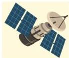

INKORANYAMUGA YIKORANABUHANGA

mudasobwa. SH: Inyandiko yoherezwa muri imeyiri igamije gusuzuma niba ukoresha konti ariwe nyirayo cyangwa akoreraho ubucuruzi bwizewe.

**Icyemezo ntahurambuga** (icyeemezo ntaahuurambuga). Eng: Secure sockets layer certificate (SSL); SSL certificate; secure certificate; certificate. Fr: Certificat SSL; certificat sécurité; certificat. NK: Ikoranabuhanga rya murandasi. SH: Icyemezo cy'ikoranabuhanga cyemeza umwirondoro w'urubuga kandi kigatuma habaho guhuza urubuga n'umukoresha.

**Icyesha n'iringanizangano** (icyesha n'iringaniza). HI: Iringaniza nkeshafoto (iriinganiza nkeeshafoto). Icyesha ndinganizafoto (icyeesha ndiinganizafoto). Eng: Resolution and Resizing. Fr: Résolution et redimensionnement. NK: Urusobe ntangamakuru. SH: Uburyo bw'ikoranabuhanga bwo guhindura ubunini bw'ifoto hakurikijwe umubare w'utunyangingo foto (pixels), bikagira ingaruka ku bunini bwa dosiye no ku bwiza bw'imigaragarire y'ifoto.

**Icyiciro cy'amabwiriza mbonezanzira** (icyiiciro cy'amabwiriza mbonezanzira). Eng: Protocol layer. Fr: Couche de protocole. NK: Ikoranabuhanga rya murandasi. SH: Igikoresho cyihariye kandi cyubatse ku buryo hari ibiruta ibindi bikoze

icyuma nyaruhererekane cyangwa ikoranabuhanga rya murandasi, kikaba gishinzwe kuyobora imimaro, amategeko n'imikoranire yihariye mu ihuzanzira.

**Icyiciro cy'inkoranabuhanga** (icyiiciro cy'iinkōranabūhaānga). Eng: Application layer. Fr: Couche d'application. NK: Ikoranabuhanga rya mudasobwa. SH: Agace nyurabwenge kagena imbonezanzira zisangiwe z'itumanaho n'imikorere y'uruganiriro ikoreshwa n'abakoresha ihuzanzira ry'itumanaho.

**Icyiciro ntwaramakuru** (icyiiciro ntwāaramākurū). Eng: Transport layer. fr: Couche de transport. NK: Itumanaho koranabuhanga. SH: Inzira ntwaramakuru yo ku rwego rwa kane mu buryo bw'itumanaho