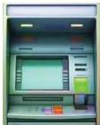

INKORANYAMUGA YIKORANABUHANGA

bwa OSI butanga igisubizo cyuzuye ku ntangiriro no ku iherezo mu ihererekanyamakuru ryizewe hagati y'abantu babiri kuko rikoreshwa mu ntangiriro no mu iherezo ry'ih ererekanyamakuru IP.

**Icyogajuru** (icyoogajuru). Eng: Satellite. Fr: Satellite. NK: Ikoranabuhanga rya murandasi. SH: Igikoresho gihuza kikabika amakuru yose ahererekanywa mu duce dutandukanye tw'isi hifashishijwe ibikoresho by'itumanaho.

**Icyoherejwe** (icyoôherejwe). Eng: Sent. Fr: Message envoyé. NK: Ikoranabuhanga rya mudasobwa. SH: Ububiko bubamo kopi za imeri zose wohereje.

**Icyuma ntangafaranga** (icyûuma ntaangafaraanga)
**Icyuma mpererekanyafaranga** (icyuma mpererekanyafaranga). HI.; icyuma mbikurafaranga (icyûuma mbiikuurafaraanga). Eng: Automated teller machine (ATM). Fr: Guichet automatique bancaire (GAB); distributeur automatique de billets (DAB). NK: Ikoranabuhanga ry'imari. SH: Aho umuntu ashobora kubika amafaranga ye, kuyabikuza, kureba asigaye kuri konti atarinze kujya muri banki ahubwo hakoreshejwe uburyo bw'ikoranabuhanga bw'ikarita.

**Icyumba cy'itumanaho** (icyuûmba cy'iitūmanahô). Eng: Communication room. Fr: Salle de communication. NK: Isakazamakuru. SH: Icyumba cyubatswe mu nyubako aho sosiyete yakora itumanaho rigezweho n'ibikoresho byose by'urusobe.

**Icyumba mpahabwenge** (icyuûmba mpâahabwêenge). HI: Iguriro rya murandasi (iguriro ryaa mûraandasi). HI: Iguriro rya interneti (iguriro ryaa interineêti). Eng: Internet café. Fr: Cybercafé. NK: Ikoranabuhanga ry'imari. SH: Ahantu hagenewe kwakira abantu bashaka gukoresha interneti batanze ubwishyu. Hagurwa serivisi itangwa n'iyi interneti : Risanzweho ryarafashe.

**Idadira** (idādira). HI: Ikare (ikare). Eng: Lock. Fr: Verrou. NK: Ikoranabuhanga rya mudasobwa. SH: Uburyo butuma bidashoboka kugera ku ifishiye cyangwa ku yandi makuru.