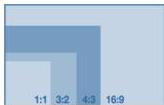

INKORANYAMUGA Y'IKORANABUHANGA

Igaragaraza makuru (igāragarazamākurū). Eng: External Data Representation (XDR). Fr: Représentation des données externes. NK: Ikoranabuhanga rya mudasobwa. SH: Ingano mbonera y'itondeka ry'amakuru akoreshwa nko mu mbonezanzira z'ihuzanzira rya murandasi, igatuma iyohereza ry'amakuru hagati y'inzungano z'ikoranabuhanga zinyuranye rishoboka.

Igaragazangano (igaragazangano). HI: Igaragazabipimo y'indebero (igaragazabipimo y'indebero). Eng: Aspect ratio. Fr: Rapport d'aspect. NK: Ikoranabuhanga rya mudasobwa. SH: igipimo kigaragaza ingano iri hagati y'ubugari n'ubuhagarike bw'ishusho

kigaragazwa n'imibare ibiri itandukanyijwe n'utubago (:). Urugero, 4:3, ku ishusho, bivuze ko ubugari ari ibice bine (4) mu gihe ubuhagarike ari ibice bitatu (3).

Igaragazashusho (igaragazashusho). Eng: Image Display. Fr: Affichage d'image. NK: Ikoranabuhanga rya mudasobwa. SH: Igikorwa cyo kwerekana amashusho ku irebero.

Igarukiranzira (igarukiranzira). HI: Ikimirana ry'ubutumwa (ikimirana ry'ubutumwa). Eng: Bounce. Fr: Renvoi. NK: Ikoranabuhanga rya mudasobwa. SH: Isubizwa inyuma ry'ubutumwa bwoherejwe muri imeri bukagarukira uwabwoherereje bumubwira ko uwohererezwa atabonetse.

Igarura (igarura). Eng: Retrieval. Fr: Récupération. NK: Ikoranabuhanga rya mudasobwa. SH: Igikorwa cyo kugarura cyangwa gusubiza ikintu cyabitswe cyangwa cyatakaye.

Igaruramakuru ya murandasi (igāruramākurū ya mūraandasi). HI: Igaruramakuru (igāruramākurū). Eng: Online information retrieval. Fr: Récupération d'informations en ligne. NK: Ikoranabuhanga rya murandasi. SH: Sisitemu yifashishwa n'abakoresha mudasobwa igihe ashaka kubona, gushaka no kugaragaza amakuru ya mudasobwa yifashishije interneti.

Igaruramutekano (igāruramūteekano). Eng: Security Recovery; Cyber recovery; recovery. Fr: Récupération de sécurité; cyber-recupération; récupération. NK: Ikoranabuhanga rya mudasobwa. SH: