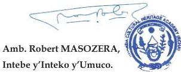

INKORANYAMUGA Y'IKORANABUHANGA

HABUMUREMYI Emmanuel (ARJ) na Bwana NSHUNGUYIMFURA Abou-Bakar (MINUBUMWE).

Ingeri y'ikoranabuhanga igizwe n'ibitsibo byinshi cyane bitewe n'uko ari rigari. Ariko hagendewe ku muga yegeranyijwe, agaragara mu bitsibo bikurikira: itangazabumenyi koranabuhanga (ICT), ikoranabuhanga rya mudasobwa (Computer Hardware), ikoranabuhanga rya murandasi (Internet Technology), itumanaho koranabuhanga (Telecommunication), isakazamakuru (Broadcasting), ubwenge buhangano (Artificial Intelligence), urusobe ntangamakuru (Multimedia), ikoranabuhanga ngaragazabimenyetso (Forensics), Ikoranabuhanga ndangamuntu (Digital Identification) n'ikoranabuhanga ry'imari (Digital Finance).

Inteko y'Umuco ikangurira inzego kugira uruhare runini mu guhindura mu Kinyarwanda amuga yo mu zindi ndimi zikoresha mu kazi kazo ka buri munsi, zigafatanya n'Inteko y'Umuco kunoza amuga bakoresha mu Kinyarwanda. Iyi nkoranyamuga y'ikoranabuhanga ikaba ije ari urugero rwiza rukurikira izindi nkoranya zayibanjirije mu gukungahaza Ikinyarwanda.

Twese hamwe dukomeze dufatanye mu gukungahaza Ikinyarwanda, tugira uruhare mu guhanga amuga mu rurimi rwacu kavukire kuko bizihutisha iterambere twese duharanira.

