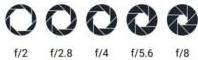

INKORANYAMUGA YIKORANABUHANGA

Igipimo cy'ubwaguke (igipimo cy'ubwaaguke). Eng: F-number/Aperture Fr: Ouvertre, Nombre F. NK: Ikoranabuhanga ry'amashusho SH:

Uburyo imboni koranabuhanga ya kamera yongera cyangwa igabanya urumuri ruyinjiramo mu ifatashusho.

Igipimo cy'umurimo koranabuhanga (igipimo cy'umurimo kōranabūhaānga). Eng: Thread. Fr: Fil Conducteur. NK: Ikoranabuhanga rya mudasobwa. SH: itsinda rito cyangwa urukurikirane rw'amabwiriza mudasobwa ishobora gukoresha no gushyira mu bikorwa, ni ryo shingiro ry'ikoreshwa ry'ingufu zo gutunganya.

Igipimo mbonera 802.11 (igipimo mbonerā 802.11). Eng: 802.11b. Fr: 802.11b. NK: Ikoranabuhanga rya murandasi. SH: Ivugurura ry'imiterere ya IEEE 802.11 ya interneti idafite insinga, ifata 11 Mbps kuri bande imwe ya 2.4 GHz.

Igipimo mbonera 802.11a (igipimo mbonerā 802.11a). Eng: 802.11a. Fr: 802.11a. NK: Ikoranabuhanga rya murandasi. SH: Uburyo bwa Wi-Fi bwakozwe na IEEE bwo kohereza amakuru hakoreshejwe umuyoboro udafite umugozi, ikoresha umuyoboro wa 5 GHz kandi yemerera kohereza amakuru ku muuduko wa 54 Mbps.

Igipimo mbonera 802.11g (igipimo mbonerā 802.11g). Eng: 802.11g. Fr: 802.11g. NK: Ikoranabuhanga rya murandasi. SH: Umurongo ngenderwaho usobanura uburyo bwo guhuza imiyoboro idafite insinga ku muyoboro w'ahantu hadafite insinga ukorera muri radiyo ya 2.4 GHz.

Igipimo mbonera 802.11n (igipimo mbonerā 802.11n). Eng: 802.11n. Fr: 802.11n. NK: Ikoranabuhanga rya murandasi. SH: Umurongo ngenderwaho cya IEEE ku miyoboro idafite insinga cyongera umuvuduko, ubwizerwe, n'urwego rw'itumanaho ridafite insinga mu miyoboro idafite insinga yo mu gace k'itumanaho.

Igipimo ndangamakuru (igipimo ndāangamākurū). Eng: Data descriptor. Fr: Descripteur de données. NK: Ikoranabuhanga rya mudasobwa. SH: Imyubakire nyamibare y'ahantu cyangwa ibimenyetso by'ishusho, byakorewe gufata ibimenyetso byihariye kugira ngo imbonezamibare zishobore kubigereranya no kubihuza n'ibindi