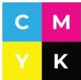
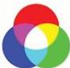

INKORANYAMUGA YIKORANABUHANGA

Ihuriro (ihūuriro). HI: Impuza (impuūza). Eng: Hub. Fr: Hub. NK: Ikoranabuhanga rya mudasobwa. SH: Igikoresho gihuza mudasobwa nyinshi n'ibikoresho.

Ihuriro ry'ihinduranya ngendanwa (ihūuriro ry'ihinduranya ngeendānwa). Eng: Mobile Switching Center. Fr: Centre de Commutation Mobile. NK: Ikoranabuhanga rya mudasobwa. SH: Inkingi ya mwamba y'ihuzanzira rya GSM /CDMA ikora nk'urwungano mpinduranyamiyoboro rugendanwa (NSS) ruhuza abahamagarwa b'abafatabuguzi ruhinduranya amatsinda y'amajwi koranabuhanga hagati y'inzira huzanzira, rugatanga amakuru ya ngombwa mu kwita ku bafatabuguzi ba serivisi ngendanwa nko kwiyandikisha no kwemeza abakoresha umuyoboro.

Ihuriro ry'imiyoboro ya murandasi (ihūuriro ry'imiyoboro ya mūraandasi). Eng: Internet Exchange Point (IXP). Fr: Point d'échange Internet. NK: Ikoranabuhanga rya murandasi. SH: Ahantu hafatika ibigo bitanga murandasi bihurira bigahana amakuru, ibyo bigo ni nk' abagurisha kwinjira muri murandasi (FAI) n' urubuga rusakaza indemo zo kuri murandasi (CDN).

Ihuzamabara rya CMYK (ihūuzamābara ryaa CMYK). Eng: Cyan Magenta Yellow Black (CMYK); CMYK color model; process color; four color. Fr: Modèle de couleur CMJN; quadrichromie. NK: Ikoranabuhanga rya mudasobwa. SH: Uburyo bwo guhuza amabara y'ubururu bw'ikirere, umwura, umuhondo n'umukara bukoreshwa mu icapiro bugatanga amabara yose bifuza.

Ihuzamabara rya RGB (ihūuzamābara ryaa RGB). Eng: Red Green Blue (RGB) Color Model. Fr: Modèle de couleur RVB. NK: Ikoranabuhanga rya mudasobwa. SH: Uburyo bwo guhuza amabara y'umutuku, icyatsi kibisi, n'umukara bukoreshwa mu icapiro bugatanga amabara yose bifuza.

Ihuzamajwi (ihūuzamājwi). Eng: Reverberation; Reverb. Fr: Réverbération. NK: Ikoranabuhanga ry'amajwi. SH: Ijwi rikomatanyirijwe n'andi majwi yagarutse vuba cyane, bigatuma