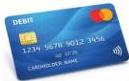

INKORANYAMUGA YIKORANABUHANGA

utitwaje amafaranga ahubwo biciye mu ikoranabuhanga hakoreshejwe ikarita ya banki nka viza.

**Ikarita mbikamakuru** (ikarita mbiikamakuru). HI: Akabikamakuru ngendanwa (akabiikamakuru ngendanwa). Eng: Memory card. Fr: Carte mémoire. NK: Ikoranabuhanga rya mudasobwa. SH: Igikoresho cy'ihunika ry'amakuru gitoroniki gikoreshwa mu guhunuka amakuru koranabuhanga, muri rusange hakoreshejwe imbikamakuru ntaremya.

**Ikarita mbikuzi** (ikarita mbiikuuzi). Eng: Debit card. Fr: Carte de débit. NK: Ikoranabuhanga ry'imari. SH: Ikarita yishyurirwaho avanse ya serivisi mbere yo kuyishyura yose.

**Ikarita ngaragazamashusho** (ikarita ngaragazamashusho). HI: Ikarita y'amashusho (ikarita y'amashusho). Eng: Graphics card; video card; graphics processing unit (GPU). Fr: Carte graphique; carte vidéo; unité de traitement graphique (GPU). NK: Ikoranabuhanga rya mudasobwa. SH: Igikoresho cy'ikoranabuhanga gikora ibijyanye n'amashusho ahagaze n'agenda ndetse na videwo, imikino, kohereza imirasire, gukora ibishushanyo no kugaragaza amafaranga koranabuhanga.

**Ikarita nyaguriro** (ikarita nyāguriro). Eng: Expansion board. Fr: Carte d'extension. NK: Ikoranabuhanga rya mudasobwa. SH: Ikarita ntwaramakuru ishobora gushyirwa muri mudasobwa kugira ngo yongere ubushobozi bwa mudasobwa, urugero hongerwa imbikamakuru cyangwa hongererwa agaciro ibishushanyo cyangwa amafoto.

**Ikarita nyamajwi** (ikarita nyamājwī). Eng: Sound card. Fr: Carte-son. NK: Ikoranabuhanga rya mudasobwa. SH: Igikoresho koranabuhanga gikora amajwi kikanayafata.

**Ikarita ya Gugo** (ikarita ya Gūugō). Eng: Google map. Fr: Carte sur Google. NK: Ikoranabuhanga rya mudasobwa. SH: Ikarita tubona twifashishije ibikoresho by'itumanaho, iyo karita ishushanya ibice by'ahantu ikagaragaza amerekezo uturutse aho uyikoresha aherereye ndetse n'aho ashaka kujya.

**Ikemurabibazo hifashishijwe ubwenge buhangano** (ikēmurabibazo hiifashiishijwe ubwēenge buhaangano). Eng: A.I. problem-solving. Fr: