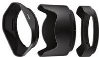

INKORANYAMUGA YIKORANABUHANGA

Ikigohe eya kamera (ikigōhe cyaa kamera) Eng: Lens shader, lens hood. Fr: Parasoleil. NK: Ikoranabuhanga ry'amashusho. SH: Igikoresho kijya kumera nk'umubirikira wagutse gishobora gushyirwa ku mfatafoto cyangwa kamera kugira ngo gikumire

urumuri rudakenewe cyangwa ikindi gishobora kubangamira imboni ya kamera (nk'ibitonyanga,...) igihe bafotora cyangwa bafata videwo, ariko ntikibangamire uko igifotorwa kigaragara mu jisho ry'ufotora binyuze mu mfatafoto cyangwa kamera.

Ikimenyetso (ikimenyeetso). Eng: Symbol. Fra: Symbole. NK: Ikoranabuhanga rya mudasobwa. SH: Ubwoko bw'amakuru bwo hambere usanga imiterere yabwo bufite isura ishobora gusomwa n'umuntu.

Ikimenyetso banga nyabuzima (ikimenyeetso baanga nyabuzima). Eng: Biometric password. Fr: Mot de Passe biométrique. NK: Ikoranabuhanga rya ngaragazabimenyetso. SH: Ibimenyetso byo ku mubiri cyangwa by'imyitwarire byihariye bikoreshwa mu kwemeza ko uwo umuntu ari we.

Ikimenyetso bwirinzi (ikimenyeetso bwīirinzi). Eng: Security token. Fr: Jeton de sécurité. NK: Ikoranabuhanga rya mudasobwa. SH: Igikoresho gituma umuntu agera ku makuru akenera urufunguzo gitoroniki kugira ngo agerweho, akaba akoreshwa nk'inyunganizi cyangwa agakoreshwa mu mwanya w'urufunguzo banga.

Ikimenyetso ndango eya mudasobwa (ikimenyeetso ndaango cyaa mūdasobwā). Eng: Computer Code; code. Fr: Code informatique; code. NK: Ikoranabuhanga rya mudasobwa. SH: Urukomatane rw'amabwiriza cyangwa urusobe rw'amategeko yanditse mu rurimi rusomwa na mudasomwa (ururimi shingiro).

Ikimenyetso nkomoko (ikimenyeetso nkōmooko). Eng: Wildcard. Fr: Caractère générique. NK: Ikoranabuhanga rya mudasobwa. SH: inyuguti ishobora gusimbura zeru cyangwa irenga mu murongo.

Ikimenyetso nyandiko (ikimenyeeteso nyandiko). Eng: Character. Fr: Caractère. NK: Ikoranabuhanga rya mudasobwa. SH: Ikinyabumwe