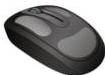

INKORANYAMUGA YIKORANABUHANGA

cy'ibikoresho bya poroseseri bikora ibikorwa by'imibare bihindagurika, bikaba ari ingenzi cyane ku bikorwa bisaba kubara neza cyane nka sisitemu zo kugenzura no gusesengura ibimenyetso by'ikoranabuhanga.

**Imbeba** (imbeba). Eng: *Computer mouse*; mouse. Fr: *Souris d'ordinateur*; souris. NK: *Ikoranabuhanga rya mudasobwa*. SH: Igikoresho cyitwazwa gituma umuntu ahagarara aho ashaka kugira icyo ahakora mu irebero, gikoresha akanyerezo ngaragazahantu gahagaze gahumbaguza mu irebero bigatuma umuntu akora igenzura ryoroshye ry'irebero hakoreshejwe ingaragazamashusho ya mudasobwa.

**Imbeba nziramugozi** (imbeba nziramūgozī). Eng: *Wireless mouse*; cordless mouse. Fr: *Souris sans fil*. NK: *Ikoranabuhanga rya mudasobwa*. SH: *Inyinjizamakuru nziramugozi ituma ukoresha mudasobwa akorana na yo atarinze abangamirwa n'umugozi*, igatanga imikoranire yoshye kandi iboneye.

**Imbibi z'ishusho y'igifotorwa** (imbibi z'ishusho y'igifōtorwa). Eng: *Pose Subject Isolation*. Fr: *Pose d'isolement du sujet*. NK: *Ikoranabuhanga rya mudasobwa*. SH: *Ni imbibi zigaragaza aho igifotorwa kimwe cyangwa byinshi bigarukira habaye gusesengura amashusho asanzwe cyangwa amashusho ya videwo.*

**Imbikamakuru** (imbīkamākurū). HI: *Disike* (diisīke). Eng: *Disk*. Fr: *Disque*. NK: *Urusobe ntagamakuru*. SH: *Igikoresho cyabugenewe gikoreshwa mu kubika amakuru y'inyandiko, amafoto, amajwi, videwo na porogaramu ku buryo ushobora kuyasoma cyangwa ukayandika igihe cyose ubishakiye.*

**Imbikamakuru adategerezwa** (imbīkamākurū adāteghēezwa). HI: *Imbikamakuru nyunganizi* (imbīkamākurū nyungaanizi). Eng: *Cache memory*; cache. Fr: *Mémoire cache*; cache. NK: *Ikoranabuhanga rya mudasobwa*. SH: *Agace kabika amakuru y'igihe gito kugira ngo agerweho mu buryo bwihuse.*

**Imbikamakuru ageza ku mashusho by'agateganyo** (imbīkamākurū agēza ku mashusho by'āgatēganyo). HI: *Imbikamashusho ntazigwa* (imbīkamashusho ntazigwā). Eng: *Video Random Access Memory* (VRAM). Fr: *Mémoire vidéo à accès aléatoire*. NK: *Ikoranabuhanga rya mudasobwa*. SH: *Igikoresho cya sisitemu*