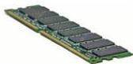
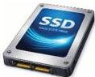
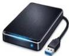

INKORANYAMUGA YIKORANABUHANGA

gikoreshwa neza mu kubika no gukoresha porogaramu ariko ku mbaraga z'ishusho n'ibishushanyo.

## Imbikamakuru by'agateganyo

(imbikamakuru by'agateganyo). HI: Imbikamakuru ya RAM (imbikamakuru ya RAM). Eng: Computer memory; random Access Memory (RAM); main memory; memory. Fr: Mémoire d'ordinateur; mémoire vive (RAM), mémoire. NK: Ikoranabuhanga rya mudasobwa. SH: Uburyo bukoreshwa mu kubika amakuru na gahunda ku buryo budahoraho cyangwa ku buryo buhoraho kugira ngo mudasobwa izayakoreshe.

## Imbikamakuru idasibama (imbikamakuru idasibama). Eng: Nonvolatile memory (NVM). Fr: Mémoire non volatile; stockage non volatile. NK: Ikoranabuhanga rya mudasobwa. SH: Ububiko bushobora kubika amakuru igihe cyose niyo mudasobwa yaba izimijwe.

## Imbikamakuru munyarutsa (imbikamakuru munyarutsa). HI: Imbikamakuru ya SSD (imbikamakuru ya SSD). HI: Disike ya SSD (diisike ya SSD). Eng: Solid State Drive (SSD). Fr: Disque SSD. NK: Ikoranabuhanga rya mudasobwa. SH: Ubwoko bwa disiki ikomeye, ariko ntigira ibice byimuka kandi ikaba igizwe na furashi yibuka ya banki ishobora gufata.

## Imbikamakuru ncomekwa (imbikamakuru ncomekwa). HI: Imbikamakuru nini ngendanwa (imbikamakuru nini ngeendanwa). Eng: External disk. Fr: Disque externe. NK: Ikoranabuhanga rya mudasobwa. SH: igikoresho cyo kubika amakuru gifatirwa hanze ya mudasobwa, kigahuza na yo binyuze kuri USB cyangwa undi murongo wo kuyinyuza.

## Imbikamakuru nsomesharumuri (imbikamakuru nsomeesharumuri). HI: Disike nsomesharumuri (diisiki nsomeesharumuri); disike ya razeri (diisiki ya razeeri). Eng: Optical disk. Fr: Disque optique. NK: Ikoranabuhanga rya mudasobwa. SH: Ubwoko bwa disike ibika amakuru akanasomwa hakoreshejwe ikoranabuhanga urumuri rwa razeri ku buso bwayo nka sede, dividi).